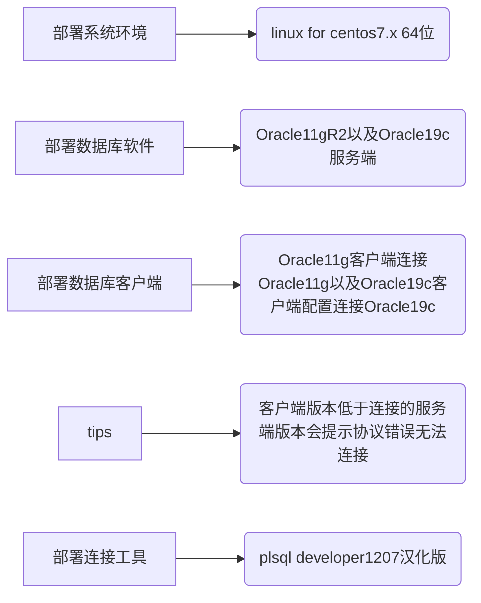

# 前言
此次课题，基于linux for centos7.x进行安装部署，分别部署Oracle11g和Oracle19c进行对比。

**强调一下Oracle11g基于zip安装包（有图形化界面），如果是rpm包安装（可以参考本文Oracle19c的部署）。**

之前一直在Windows上进行安装部署测试的，其实在linux操作系统上部署基本上可以参考Windows的图形界面安装。

图形化安装和Windows配置是差不多的，我安装的时候就是参考以前Windows上部署的经验。

部分安装注意事项还是需要注意，比如不能用root用户直接安装，需要新建普通用户安装。


说明：Oracle11g采用是带有桌面环境的系统部署，Oracle19c纯字符界面进行部署。

**基本环境准备**




1、部署系统环境：linux for centos7.x 64位
2、部署数据库软件：Oracle11gR2以及Oracle19c服务端
3、部署数据库客户端：Oracle11g客户端连接Oracle11g，Oracle19c客户端配置连接Oracle19c
3.1、tips：客户端版本低于连接的服务端版本，会提示协议错误，无法连接。
4、部署连接工具：plsql developer1207（汉化）


# 正文

## 一、注意事项

### 1、开启xhost +
```powershell
#以root用户执行命令
xhost +
```

### 2、加入ip
加入你的ip配置
```powershell
#以root用户执行命令
#例如：export $DISPLAY=192.168.245.233:0.0
export $DISPLAY=IP:0.0
```

### 3、新增oracle用户

3.1、新增用户
```powershell
#新增oracle用户
adduser oracle
```

3.2、修改密码
```powershell
#修改密码
passwd oracle
```

3.3、切换用户
```powershell
#切换用户oracle
su oracle
```


## 二、完全安装
直接配置(create and configure a database：选择创建并配置数据库)
监听设置以及实例化在图形界面会提示配置。


## 三、分步骤安装
（install database software only：仅安装数据库软件 ）
解压文件：unzip 文件名 
然后进入database文件目录执行安装


### 1、安装软件
```powershell
#切换用户oracle
su oracle
#执行命令
sh runInstaller 
#或者执行 
./runInstaller
```
### 2、乱码问题临时解决（安装显示英文模式）
```powershell
LANG=en_US sh runInstaller 
#或者
LANG=en_US ./runInstaller
```

### 3、首先进入到安装软件后的oracle的bin目录


3.1、切换至bin目录
```powershell
#进入bin目录
cd /home/oracle/app/product/11.2.0/dbhome_1/bin/
#直接查看bin目录下的文件
ls /home/oracle/app/product/11.2.0/dbhome_1/bin/
```

### 4、安装监听
```powershell
./netca
#临时解决乱码问题，以英文模式安装
LANG=en_US.UTF-8 ./netca 
```

### 5、安装数据库实例
```powershell
./dbca
#解决乱码问题，以英文模式安装
LANG=en_US.UTF-8 ./dbca
```

## 四、优化配置

### 1、部署目录
```powershell
#部署目录，此处部署目录根据实际情况调整
/home/oracle/app/product/11.2.0/dbhome_1/bin/
#进入bin目录
cd /home/oracle/app/product/11.2.0/dbhome_1/bin/
#直接查看bin目录下的文件
ls /home/oracle/app/product/11.2.0/dbhome_1/bin/
```

### 2、设置主机名，重启服务器生效
```powershell
#set hostname
vim /etc/hostname
```

### 3、设置监听服务
```powershell
#set listener tnsnames
vim /home/oracle/app/product/11.2.0/dbhome_1/network/admin/listener.ora 
vim /home/oracle/app/product/11.2.0/dbhome_1/network/admin/tnsnames.ora
```

3.1、listener.ora 配置文件新增内容
```powershell
# listener.ora Network Configuration File: /home/oracle/app/product/11.2.0/dbhome_1/network/admin/listener.ora
# Generated by Oracle configuration tools.
#listener.ora 配置文件新增内容，新增内容视具体情况修改
SID_LIST_LISTENER =
  (SID_LIST =
    (SID_DESC =
      (SID_NAME = orcl)
      (ORACLE_HOME = /home/oracle/app/product/11.2.0/dbhome_1/)
      #(PROGRAM = extproc) //去掉PROGRAM = extproc，外部通道调用动态dll
      (ENVS = "EXTPROC_DLLS=ONLY:/home/oracle/app/product/11.2.0/dbhome_1/bin/oraclr11.dll")
    )
  )

#原始配置，HOST一般是主机名或者localhost或者127.0.0.1，个人推荐设置固定IP
LISTENER =
  (DESCRIPTION_LIST =
    (DESCRIPTION =
      (ADDRESS = (PROTOCOL = TCP)(HOST = 192.168.245.147)(PORT = 1521))
    )
  )

ADR_BASE_LISTENER = /home/oracle/app

```


3.2、tnsnames.ora新增内容
```powershell
# tnsnames.ora Network Configuration File: /home/oracle/app/product/11.2.0/dbhome_1/network/admin/tnsnames.ora
# Generated by Oracle configuration tools.
#tnsnames.ora新增内容
ORACLR_CONNECTION_DATA =
  (DESCRIPTION =
    (ADDRESS_LIST =
      (ADDRESS = (PROTOCOL = IPC)(KEY = EXTPROC1521))
    )
    (CONNECT_DATA =
      (SID = CLRExtProc)
      (PRESENTATION = RO)
    )
  )

#原始配置
ORCL =
  (DESCRIPTION =
    (ADDRESS = (PROTOCOL = TCP)(HOST = 192.168.245.147)(PORT = 1521))
    (CONNECT_DATA =
      (SERVER = DEDICATED)
      (SERVICE_NAME = orcl)
    )
  )

```


### 4、切换用户
```powershell
#切换到oracle用户
sudo oracle
```

### 5、配置oracle环境变量

```powershell
#进入当前用户的home（家目录）
cd ~
```

5.1、设置oracle环境变量
```powershell
#oracle home，设置oracle环境变量
vim .bash_profile 
```

5.2、加入配置（仅供参考）
```powershell
ORACLE_BASE=/home/oracle/app;
ORACLE_HOME=$ORACLE_BASE/product/11.2.0/dbhome_1;
PATH=$ORACLE_HOME/bin:$PATH;
ORACLE_SID=orcl;

export ORACLE_SID ORACLE_BASE ORACLE_HOME PATH
```

5.3、bin目录说明
切换到Oracle服务安装后的bin目录，很多命令都是在此目录的，切换至此目录使用更便捷。
其中的监听lsnrctl监听服务启动以及sqlplus工具都在此目录，当然也可以不用切换进来，linux最原始是采用绝对路径执行命令脚本的。
```powershell
cd /home/oracle/app/product/11.2.0/dbhome_1/bin/
```

### 6、启动监听
```powershell
./lsnrctl start
```


### 7、设置所用户生效
```powershell
#需要root用户执行
#设置所用户生效
vim /etc/profile
```
```powershell
#设置所用户生效
ORACLE_BASE=/home/oracle/app;
ORACLE_HOME=$ORACLE_BASE/product/11.2.0/dbhome_1;
PATH=$ORACLE_HOME/bin:$PATH;
ORACLE_SID=orcl;

export ORACLE_SID ORACLE_BASE ORACLE_HOME PATH
```

启动监听，如下图所示，启动成功


```powershell
#启动监听，此时已经切入到了bin目录进行操作
./lsnrctl start
#关闭监听
./lsnrctl stop
#查看监听状态
./lsnrctl status
./lsnrctl stat
```

### 8、登录验证
```powershell
#登录
sqlplus /nolog
```
连接sqlplus
```powershell
#连接sqlplus
conn system as sysdba
```

### 9、启动与关闭实例
```powershell
#启动实例
startup
#关闭实例
shutdown
```


## 五、解决问题
### 1、Oracle home环境变量
定位问题：message 1070 not found


解决问题：加入Oracle环境变量，参看上面的优化配置
```powershell
#切换到当前用户home目录
cd ~
#查看环境变量
cat .bash_profile
```

### 2、listener.ora、tnsnames.ora监听文件
参考：个人部署oracle数据库监听文件位置所在目录


```powershell
#检查listener.ora
cat /home/oracle/app/product/11.2.0/dbhome_1/network/admin/listener.ora 
#检查tnsnames.ora
cat /home/oracle/app/product/11.2.0/dbhome_1/network/admin/tnsnames.ora
```

### 3、主机名一致性
```powershell
#检查主机名
cat /etc/hostname
#检查hosts文件配置
cat /etc/hosts
#检查listener.ora 
cat /home/oracle/app/product/11.2.0/dbhome_1/network/admin/listener.ora 
#检查tnsnames.ora
cat /home/oracle/app/product/11.2.0/dbhome_1/network/admin/tnsnames.ora
```

### 4、安装时显示乱码问题
```powershell
#在命令前加上,临时生效
LANAG=en_US
```

### 5、关于服务开机自启问题

5.1、使用官方提供的脚本
```powershell
#执行root.sh脚本
/home/oracle/app/product/11.2.0/dbhome_1/root.sh
```

5.2、验证oratab文件
```powershell
#验证oratab文件
ls /etc/oratab
```

```powershell
#代表开启自动
$ORACLE_SID:$ORACLE_HOME:Y
通过dbstart、dbshut控制启动与停止服务
```

### 6、关于oratab文件
提示`/etc/oratab`文件不可用，需要使用root用户去执行root.sh。
原因：使用普通用户oracle，权限不足。

**使用官方提供的脚本**
```powershell
#执行root.sh脚本，以root用户身份执行，或者sudo提权
/home/oracle/app/product/11.2.0/dbhome_1/root.sh
```


## 六、Oracle19c安装

友情提示：下载需要注册Oracle账号并且登录，真的很骚。

### 1、准备安装包
官网地址
[https://www.oracle.com/cn/database/technologies/oracle-database-software-downloads.html#19c](https://www.oracle.com/cn/database/technologies/oracle-database-software-downloads.html#19c)

下载地址
[https://www.oracle.com/webapps/redirect/signon?nexturl=https://download.oracle.com/otn/linux/oracle19c/190000/oracle-database-ee-19c-1.0-1.x86_64.rpm](https://www.oracle.com/webapps/redirect/signon?nexturl=https://download.oracle.com/otn/linux/oracle19c/190000/oracle-database-ee-19c-1.0-1.x86_64.rpm)


### 2、依赖环境安装

2.1、前提条件（rpm安装会提示依赖包）
```powershell
yum -y install libaio-devel
yum -y install ksh
```

### 3、正式安装

3.1、rpm命令安装
```powershell
rpm -ivh oracle-database-preinstall-19c-1.0-3.el7.x86_64.rpm
rpm -ivh oracle-database-ee-19c-1.0-1.x86_64.rpm
```

3.2、或者使用yum形式安装
```powershell
yum -y install oracle-database-preinstall-19c-1.0-3.el7.x86_64.rpm
yum -y install oracle-database-ee-19c-1.0-1.x86_64.rpm
```

### 4、执行部署配置

4.1、配置

```powershell
/etc/init.d/oracledb_ORCLCDB-19c configure
```

4.2、默认安装位置

```sql
--SID：ORCLCDB
/opt/oracle/product/19c/dbhome_1/
```

4.3、加入环境变量
```powershell
#进入当前用户家目录
cd ~
#编辑当前用户的环境变量
vim .bash_profile
```

```powershell
#加入环境变量
ORACLE_BASE=/opt/oracle;
ORACLE_HOME=$ORACLE_BASE/product/19c/dbhome_1;
PATH=$ORACLE_HOME/bin:$PATH;
ORACLE_SID=ORCLCDB;

export ORACLE_SID ORACLE_BASE ORACLE_HOME PATH
```

4.4、执行后生效
```powershell
#执行后生效
source .bash_profile
```

### 5、登录验证
5.1、登录sqlplus验证
```sql
--登录sqlplus验证
/opt/oracle/product/19c/dbhome_1/bin/sqlplus / as sysdba
```

5.2、显示用户
```sql
show user;
```

5.3、启动实例
```sql
--启动实例
startup;
```

5.4、修改system密码
```sql
--修改system用户密码
alter user system identified by 123456;
```

5.5、配置Oracle19c客户端数据源

Oracle19默认安装实例名为：ORCLCDB
目前使用最广泛的还是Oracle11g。这里提一下，在Oracle12的版本加入了容器新特性。

5.6、配置plsql developer

前提：Oracle19c的客户端正常安装


使用工具连接，此时可以检测到我利用Oracle19c客户端配置的134数据源。


### 6、优化
6.1、设置字符集，统一编码

tips：如果字符集设置的不统一，你看到的sqlplus提示会显示为"xxx ???"这种形式

设置中文（我部署的centos7选择的中文）
```sql
export NLS_LANG="Simplified Chinese_china.al32utf8"
```

Oracle默认的编码
```sql
--Oracle默认的编码
export NLS_LANG="SIMPLIFIED CHINESE_CHINA.ZHS16GBK"
```


6.2、创建用户需要加c##的问题

6.2.1、解决方案一
```sql
--报错
create user test;
```

```sql
--解决问题
reate user c##test;
```

**经过思考以及参考书籍发现：导致原因是与容器数据库新特性有关**

6.2.2、解决方案二
```sql
--我修改了并没生效
ALTER PLUGGABLE DATABASE PDB$SEED CLOSE ;
```

6.2.3、解决方案三
在安装的过程之前取消勾选新特性容器数据库的选项

**或许会有更优化的解决方案，欢迎留言，共同进步！**

## 七、关于自启
我只提供思路，网上的教程很多。

1、利用官方提供的脚本设置

2、自己写shell脚本设置，锻炼写脚本的逻辑能力，孰能生巧。
或者偷偷懒，使用别人写好的脚本，优化一下，然后设置开机自启。

3、然后加入的/ect/rc.local文件中，开机运行


# 开心一刻

> 只要你找个好老板，找一份好工作，好好工作。
> 辛勤工作，早起晚归，经常加班。
> 早晚有一天，这个老板，会更有钱。
> 换更好的车，换更好的房。
> 再给我一个机会，我想回到昨天，因为我安眠药吃多了。

上面的引用就当玩笑话，乐呵乐呵。创作乐无边，学而思有境。好了，到此为止就是此篇文章的全部内容了，**能看到这里的都是帅哥靓妹啊**！！！善于总结，其乐不穷。**好记性不如烂笔头**，多收集自己第一次尝试的成果，收获也颇丰。**你会发现，自己的知识宝库越来越丰富**。白嫖有瘾，原创不易，快乐学习！


<H3 align=center><a href="https://blog.csdn.net/Tolove_dream">by 龙腾万里sky 原创不易，白嫖有瘾</a></H3>
