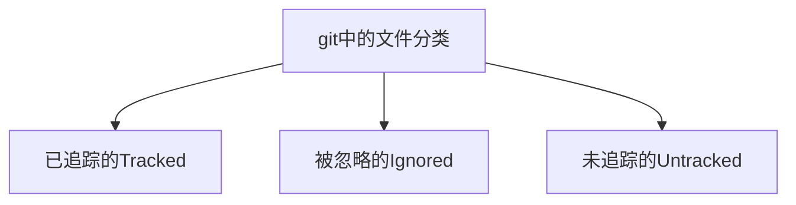

# 前言

这一夜，注定是个不眠之夜，小白和cangls的对话已然进入了白热化。小白孜孜不倦的咨询关于git方面的知识，对索引越来越感兴趣。小白以前存的小电影文件可以进行版本的对比，探索哪个版本画质更好。

**小白**：cangls，我最近有点疑惑。
**cangls**：具体是哪些方面呢？

**小白**：最近有些需求，我需要对文件进行版本管理控制，但是有些问题百思不得其解。
**cangls**：版本管理啊，这个我可熟悉呢，最近也在总结系列文章。看了之后，相信会对你有所帮助。

Linus Torvalds在Git邮件列表里曾说如果不先了解索引的目的，你就不能完全领会Git的强大之处。

本文为个人Git系列文章第二弹，git进阶内容之不得不了解的文件管理与索引。Git的索引不包含任何文件内容，它仅仅追踪你想要提交的那些内容。当执行git commit命令的时候，Git会通过检查索引而不是工作目录来找到提交的内容。虽然git在底层为了我们处理了很多事情，但记住索引和它的状态也很重要。在任何时候都可以通过git status命令来查询索引的状态。


# 正文

VCS的经典问题之一就是文件重命名会导致它们丢失对文件历史记录的追踪。而Git即使经过重命名，也仍然能保留历史信息。在实际的工作使用中，貌似Git系统处理文件重命名的方式更优越一点点。因为啊，git有多种方式处理重命名一个文件（比如：使用git rm配合git add、git mv），而以往的程度还不足以确保SVN知道所有的情况。但是，还没有能完美处理重命名的文件系统。

## 一、git文件分类

### 1、git文件分类

git将所有文件分为3类：已追踪的、被忽略的和未追踪的，如下图所示。



#### 1.1、已追踪的（Tracked）

已追踪的文件是指**已经在版本库中的文件**，或者是**已经暂存到索引中的文件**。如果想将新文件newfile添加到为已追踪（Tracked）的文件，执行`git add newfile`命令即可。例如暂存index.html文件。

```bash
git add index.html
```


#### 1.2、被忽略的（Ignored）

被忽略的文件必须**在版本库中被明确申明为不可见或被忽略**，即使它可能会在你的工作目录中出现。一个软件项目通常会有很多倍忽略的文件（使用过SVN开发Java的小伙伴就很熟悉了，通过提交时我们可以选择忽略哪些固定的文件不提交）。普通被忽略的文件包含临时文件、个人笔记、编译器输出文件以及构建项目过程中自动生成的大多数文件等等。**Git维护一个默认忽略文件列表**，也可以配置版本库来识别其它文件。

#### 1.3、未追踪的（Untracked）

未追踪的文件是指那些不在前两类中的文件。Git把工作目录下的所有文件当成一个集合，减去已追踪的文件和被忽略的文件，剩余部分最为未被追踪的文件（Untracked）。

这里测试，初始化了一个名为test目录的仓库，原本包含了一个demo-1-0.0.1-SNAPSHOT.jar文件。但是我没有将其暂存或者是添加到版本库中，就是如下你看到的显示未追踪的文件（Untracked files）。

```bash
$ git status
HEAD detached at bd156ab
Untracked files:
  (use "git add <file>..." to include in what will be committed)
        demo-1-0.0.1-SNAPSHOT.jar

nothing added to commit but untracked files present (use "git add" to track)
```

为了演示说明，**重新初始化了一个sky工作目录**。通过创建一个全新的工作目录和版本库并处理一些文件来测试验证这些不同类别的文件。

```bash
#初始仓库sky
$ git init
Initialized empty Git repository in D:/work/sky/.git/

#查看状态
$ git status
On branch master
No commits yet
nothing to commit (create/copy files and use "git add" to track)

#输入数据到sky仓库的sky文件中
echo "new data" >> sky
#再次查看状态，显示一个未被追踪的文件sky
$ git status
On branch master
No commits yet
Untracked files:
  (use "git add <file>..." to include in what will be committed)
        sky
nothing added to commit but untracked files present (use "git add" to track)
```

起初，目录里没有文件，已经追踪的文件和被忽略的文件都是空的，因此未追踪的文件也是空的。一旦创建了一个sky文件，`git status`就会报告一个未追踪的文件。

编辑器和构建环境常常会在源码文件周围遗留一些临时文件。在版本库中这些文件通常是不应该被当做源文件追踪的。为了让Git忽略目录中的文件，只需要将该文件名添加到一个特殊的文件`.gitignore`中即可。手动创建一个测试的垃圾文件test.o，然后放入.gitignore文件中进行维护。如下是演示过程中的示例：

```bash
#手动创建一个测试的垃圾文件
$ touch test.o
#查看状态，此时未添加到忽略文件中进行维护
$ git status
On branch master
No commits yet
Untracked files:
  (use "git add <file>..." to include in what will be committed)
        sky
        test.o
nothing added to commit but untracked files present (use "git add" to track)

#添加到忽略文件.gitignore，然后查看状态与之前进行对比
$ echo test.o > .gitignore
$ git status
On branch master
No commits yet
Untracked files:
  (use "git add <file>..." to include in what will be committed)
        .gitignore
        sky
nothing added to commit but untracked files present (use "git add" to track)
```

通过上面的一系列操作，这样test.o已经被忽略掉了，但是git status现在显示出一个新的未追踪的文件`.gitignore`。虽然.gitignore文件对Git有特殊的意义，但是它和版本库中任何其它普文件都是同样管理的。除非将.gitignore文件添加到索引中，否则Git仍然会将她当成未追踪的文件。下面将展示不同的方式来改变文件的追踪状态，以及如何添加或者从索引中删除她。


## 二、git add命令

回顾git add使用

```bash
#新增一个工作目录test
$ mkdir test
#初始化化一个仓库
git init
#暂存test.md文件
git add test.md
```

**注意**：在暂存的过程中，你会发现`git diff`这个命令非常的有用。**这条命令可以显示出两组不同的差异**，git diff显示仍然留在工作目录中且未暂存的变更；`git diff --cached`**显示已经暂存且因此需要有助于下次提交的变更**。

#### 1、git add用法，探寻原理

git add 命令的意义是将暂存一个文件。以Git文件分类而言，如果一个文件是未追踪的，那么`git add`会将文件的状态转化为**已追踪状态**。如果git add**作用一个目录**，那么该目录下的**所有文件都会被递归为已追踪状态暂存起来**。接着之前的例子，继续进行讲解。

```bash
$ git status
On branch master
No commits yet
Untracked files:
  (use "git add <file>..." to include in what will be committed)
        .gitignore
        sky
nothing added to commit but untracked files present (use "git add" to track)
#将sky和.gitignore文件暂存，查看状态对比
$ git add sky .gitignore
$ git status
On branch master
No commits yet
Changes to be committed:
  (use "git rm --cached <file>..." to unstage)
        new file:   .gitignore
        new file:   sky
```

第一条git status目录显示有两个未追踪的文件，**并友好的提醒你要追踪一个文件**，只需要使用`git add <file>...`命令即可。使用git add命令之后，暂存和追踪sky以及.gitignore文件，并准备在下次提交的时候添加到版本裤中。

在Git的对象模型方面，发出`git add`命令时对每个文件的全部内容都将被复制到对象库中，并且按文件的SHA1名来索引。**暂存一个文件也称作为缓存**（cacheing）一个文件，或者是称为**将文件放入索引**，其实上面已经看到了提示`--cached`。可以使用`git ls-files`命令查看隐藏在对象模型下的文件，并且可以找到那些暂存文件的SHA1值。

```bash
$ git ls-files --stage
100644 85c292ca0717bb097b55af3b961c493190d1a4aa 0       .gitignore
100644 116c7ee1423b9a469b3b0e122952cdedc3ed28fc 0       sky
```

在版本库中大多数的日常变化可能只是简单的编辑。但在任何编辑后，提交变更之前，请执行`git add`命令，用最新的版本文件去更新索引。如果不这么去做，你将会得到两个不同版本的文件：**一个在对象库中是被索引引用**的，**另一个则在你的工作目录下**。继续之前的示例，改变sky文件，使之有别与索引中的那个文件，然后使用来自神秘的东方的韩天尊的无敌逃跑技能。开个玩笑，其实是命令git hash-object file（你几乎不会直接调用她）来直接和输出的这个新版本的SHA1散列值。

```bash
$ git ls-files --stage
100644 85c292ca0717bb097b55af3b961c493190d1a4aa 0       .gitignore
100644 116c7ee1423b9a469b3b0e122952cdedc3ed28fc 0       sky
#通过vim修改，新增了add new some data now
$ cat sky
new data
add new some data now
#使用命令计算SHA1散列值
$ git hash-object sky
e24bcd708d232113f9012a5ece0a64eb97f3921e
```

在略做修改之后，你会发现保存在对象库和索引中的那个文件的**上一个版本的SHA1值是**`116c7ee1423b9a469b3b0e122952cdedc3ed28fc`。然而在更新sky文件后，**版本的SHA1值则变成了**`e24bcd708d232113f9012a5ece0a64eb97f3921e`。接下来更新索引，使之包含文件的最新版本。

```bash
$ git add sky
$ git ls-files --stage
100644 85c292ca0717bb097b55af3b961c493190d1a4aa 0       .gitignore
100644 e24bcd708d232113f9012a5ece0a64eb97f3921e 0       sky
```

现在索引有了更新后的文件版本。简单来概括：**文件已经暂存**了，或者是**sky文件在索引中**。在文件索引中这种说法并不是很确切，因为实际上文件存在对象库中，**索引只是指向她而已**。看似无用的处理SHA1散列值和索引，却带来一个关键点：与其将`git add`看成是**添加这个文件**，不如看作是**添加这个内容**。

在任何情况下，最重要的是**要记住工作目录下的文件版本和索引中暂存的文件版本可能是不同步的**。当提交的时候，**git会使用索引中的文件版本**。

## 三、git rm命令

回顾简单用法，例如删除test.md文件（前提是已暂存了）

```bash
#删除test.md文件
git rm test.md
```

### 1、git rm命令的用法

`git rm`命令自然是与`git add`相反的命令。她会在版本库和工作目录中同时删除文件。然而，由于删除文件比添加文件问题更多（假如出现错误），git对移除文件更多一些关注。

Git可以从索引或者同时从索引和工作目录中删除一个文件。Git不会只从工作目录中删除一个文件，普通的rm命令可用于这一目的。

从工作目录和索引中同时删除一个文件，**并不会删除该文件在版本库中的历史记录**。文件的任何版本，只要是提交到版本库中的历史记录中的一部分，就会留在对象库里并保存历史记录。继续上述的例子，引入一个不应该暂存的**意外文件**，看如何将其删除。

```bash
#新增了一个意外文件rdms
$ echo "random file data" > rdms
#提示：无法对Git认为是other的文件执行git rm
#应该只是用rm rdms
$ git rm rdms
fatal: pathspec 'rdms' did not match any files
```

因为git rm也是一条**对索引进行操作的命令**，所以对没有添加到版本库中或索引中的文件是不起作用的。Git必须先认识到文件才行，所以下面**偶然的暂存rdms文件**。

```bash
#意外暂存rdms文件
$ git add rdms
$ git status
On branch master
No commits yet
Changes to be committed:
  (use "git rm --cached <file>..." to unstage)
        new file:   .gitignore
        new file:   rdms
        new file:   sky
```

如果要将一个文件由已暂存的转化为未暂存的，可以使用`git rm --cached`命令。

```bash
#查看SHA1散列值
$ git ls-files --stage
100644 85c292ca0717bb097b55af3b961c493190d1a4aa 0       .gitignore
100644 087d758bdee282174e3ba5905a5e463d3d7a88dc 0       rdms
100644 e24bcd708d232113f9012a5ece0a64eb97f3921e 0       sky
#删除
$ git rm --cached rdms
rm 'rdms'
#此时对比删除前的内容，发现rdms文件已经不存在了
$ git ls-files --stage
100644 85c292ca0717bb097b55af3b961c493190d1a4aa 0       .gitignore
100644 e24bcd708d232113f9012a5ece0a64eb97f3921e 0       sky
#可以看出，加上--cached参数并不会删除工作目录中的文件
$ ls
rdms  sky  test.o
```

`git rm --cached`会删除索引中的文件并将其保留在工作目录中，而`git rm`则会将文件从索引和工作目录中同时删除。所以，**我额外的加了注意事项在文末**，并予以说明。

如果想要移除一个已经提交的文件，通过简单的git rm filename命令来暂存这一请求。

```bash
#对暂存的文件进行提交
$ git commit -m "add some files"
[master (root-commit) 82e23d4] add some files
 2 files changed, 3 insertions(+)
 create mode 100644 .gitignore
 create mode 100644 sky
#将之前暂存的文件sky移除暂存
$ git rm sky
rm 'sky'
#查看状态
$ git status
On branch master
Changes to be committed:
  (use "git restore --staged <file>..." to unstage)
        deleted:    sky

Untracked files:
  (use "git add <file>..." to include in what will be committed)
        rdms
```

Git在删除一个文件之前，她会先进行检查以确保工作目录下该文件的版本与当前分支中的最新版本（Git命令调用HEAD的版本）是匹配的。这个验证会防止文件的修改（由于你的编辑）意外丢失。

tips：还可以使用`git rm -f`来强制删除文件。强制就是明确授权，给你权限放心大胆的删除。即使从上次提交以来你已经修改了该文件，还是会删除她。

万一真的想不留那个不小心删除的文件，只要在把她添加回来即可。

```bash
$ git add sky
$ git checkout HEAD--sky
#或者提交后采取如下命令找到对应的散列值，进行恢复，rev-list命令很实用，请拿起小本本记住她
$ git rev-list master
82e23d40959116ae55ca82ced231e0069d8fc229
$ git checkout 82e23d40959116ae55ca82ced231e0069d8fc229
Warning: you are leaving 1 commit behind, not connected to
any of your branches:
  40eac09 delete some files
If you want to keep it by creating a new branch, this may be a good time
to do so with:
 git branch <new-branch-name> 40eac09
HEAD is now at 82e23d4 add some files
```

**注意**：`rev-list`命令很实用，**请拿起小本本记住她**。

此处只是顺带的提一下。当我们删除了一个文件，此时想回退到历史版本，可以使用git checkout 接上master分支的ID（SHA1）。如何找到ID值呢？这里仅仅是简单的介绍了一下`git rev-list`的用法，相信你会爱上她的。当然还可以加上参数--before，接指定的日期去查询分支。

```bash
#查询我的历史版本查看到散列值
$ git rev-list master
988df9ddbeb6b30d0bf5138f36219a8593df75e0
bd156ab27fc96e78e5515c39c05d4ecd6c36b9f0

#检出历史版本，根散列值恢复到上一个版本
$ git checkout bd156ab27fc96e78e5515c39c05d4ecd6c36b9f0
```

版本系统擅长恢复文件的旧的版本。关于`git rm`命令就演示这么多。


## 四、git mv命令

### 1、简单描述使用

例如，使用git mv命令将test.md文件重命名为Readme.md，如下命令所示。

```bash
#重命名一个文件
git mv test.md Readme.md
```

git mv命令的另一作用是移动文件位置，熟悉Linux命令的小伙伴肯定不会陌生。将test.md文件由github目录移动到gitee目录。

```bash
#移动一个文件的位置
git mv /github/test.md /gitee/
```

### 2、git mv详细用法介绍

假设你需要移动或者重命名文件。可以对旧的文件使用`git rm`命令，然后使用`git add`命令添加新文件，或者直接使用`git mv`命令。给定一个版本库，其中有一个test文件，你想要将重命名为newtest。下面一系列的命令就是等价的Git操作。

```bash
$ mv test newtest
$ git rm test
$ git add newtest
#上面三步操作等价于下面操作
$ git mv test newtest
```

无论哪种情况，**Git都会在索引中删除test的路径名**，**并添加newtest的路径名**。至于test的原始内容，则仍然保留在对象库中，然后才会将它与newtest重新关联。看起来有点绕，其实仔细琢磨一下就好了。

在示例版本库中找回test这个文件，如下重命名，然后提交变更。

```bash
$ git mv test newtest
$ git add newtest
$ git commit newtest -m "moved test to newtest"
[detached HEAD adc778e] moved test to newtest
 1 file changed, 1 insertion(+)
 create mode 100644 newtest
```

如果你碰巧检查这个文件的历史记录，你可能会不安的看到Git很明显丢失了原始的test文件的历史记录，只记得她从test从重命名为当前文件名。

```bash
$ git log newtest
commit adc778e58db37977b39a541da4498607f12bc80b (HEAD)
Author: dywangk <example@xx.com>
Date:   Mon Jan 17 20:35:56 2022 +0800
    moved test to newtest
```

其实，Git是记得全部历史记录的，但是显示要限制与在命令中指定的文件名。`--follow`选项会让Git在日志中回溯并找到内容相关联的整个历史记录。这里就不贴代码记录了，篇幅拉的太长了，可以自行修改测试。

```bash
$ git log --follow sky
```

VCS的经典问题之一就是文件重命名会导致它们丢失对文件历史记录的追踪。而Git即使经过重命名，也仍然能保留历史信息。

## 五、追踪重命名注解

**小白**：cangls啊，我以前使用过svn，没有用过Git，她们之间对重命名有啥区别吗？
**cangls**：当然有了，下面就给你科普一下。内容很长，虽然很乏味，但请耐心看完。


### 1、追踪重命名注解介绍

下面作为传统版本控制系统的典型，SVN对文件重命名和移动做了很多追踪工作。为什么呢？这是由于它只追踪文件之间的差异才导致的。例如，如果移动一个文件这本质上就相当于从旧文件中删除所有行，然后将它添加到新文件中。但是任何时候，你哪怕就做一个简单的重命名，也需要再次传输和存储文件的全部内容，这将变得非常低效；想象一下重命名一个拥有数以千计的文件的子目录，那该是多么恐怖的一件事情。

为了缓解这种情况，SVN显示追踪每一次重命名。如果你想将`test.txt`重命名为`subdir/test.txt`，**你必须对文件使用svn mv**，而不能使用`svn rm`和`svn add`。否则，SVN将不能识别出这是一个重命名，只能像刚才描述的那样进行低效的删除、添加步骤。

接着，要有追踪重命名这个特殊功能，SVN服务器需要一个特殊协议来告诉她的客户端，**请将test.txt移动到subdir/test.txt**。此外，每一个SVN客户端必须确保该操作（相对罕见）执行的正确性。

另一方面，**Git则不追踪重命名**。可以将text.txt移动到或者复制到任何地方，这么做只会影响树对象而已（**请记住树对象保存内容间的关系，而内容本身保存在blob中**）。查看两颗树间的差异，我们很容易发现叫 a30af53...的blob已经移到另一个新地方。即使你没有明确检查差异，系统中的每个部分都知道她已经有了那么一个blob，不再需要她的另一个副本了。

在这种情况下，像在很多其它地方一样，Git基于散列的简单存储系统简化了许多其它RCS被难倒的或者选择回避的事情。

## 六、.gitignore文件

在本文介绍暂存文件的时候，就已经简单的使用过gitignore文件来忽略不相干的test.o文件。在那个例子中，可以忽略任何文件，只要将想要忽略的文件名加到同一目录下的.gitignore文件即可。此外可以通过将文件名添加到该版本库顶层目录下的.gitignore文件中忽略她。

但是git还支持一种更为丰富的机制。**一个.gitignore文件下可以包含一个文件名模式列表，指定哪些文件要忽略**。.gitignore文件格式如下：

- 空行会被忽略，而已井号（#）开头的行可以用于注释。然而，如果#跟在其它文本后面，它就不表示注释了。
- 一个简单的字面配置文件名匹配任何目录中的同名文件。
- 目录名由末尾的反斜线（/）标记。这能匹配同名的目录和子目录，但不匹配文件或符号链接。
- 包含shell通配符，如星号（*），这种模式可以扩展为shell通配模式。
- 起始的感叹号（！）会对该行其余部分模式进行取反。此外，被之前模式排除但被取反规则匹配的文件是要包含的。取反模式会覆盖低优先级的规则。

**Git允许在版本库中任何目录下有.gitignore文件**。每个文件都只影响该目录和其所有子目录。.gitignore的规则也是级联的：可以覆盖高层目录中的规则，只要在其子目录包含一个取反模式（使用起始的“！”）。

为了解决带多个.gitignore目录的层次结构问题，也为了允许命令行对忽略文件列表的增编，Git按照下列由高到底的有限顺序：

- 在命令行指定的模式；
- 从相同目录的.gitignore文件中读取的模式；
- 上层目录中的模式，向上进行。因此，当前目录的模式能推翻上层目录的模式，而最接近当前目录的上层目录的模式优于更上层的目录模式；
- 来自.git/info/exclude文件的模式；
- 来自配置变量core.excludefile指定的文件中的模式。

**因为在版本库中.gitignore被视为普通文件，所以在复制操作过程中它会被复制，并适用于你的版本库的所有副本**。**一般情况下，只有当模式普遍适用于派生的版本库时，才应该将条目放入版本控制下的.gitignore文件中**。

当然还有一种特殊情形，有一类文件我需要忽略，但其中部分我需要追踪，此时可以使用取反（！）。

## 七、Git中对象模型和文件

到现在为止，你应该具备管理文件的基本能力。尽管如此，在哪里跟踪啥文件：在工作目录、索引还是版本库中，还是让人困惑。通过图形进行区分她们之间的区别。初始状态，在工作目录中包含file1和file2两个文件，分别为“foo”和“bar”。

4张图绘制有点粗糙，后续会优化的。

### 1、示例图1

除了工作目录下的file1和file2之外，master分支还有一个提交，它记录了与file1和file2内容完全一样的“foo”和“bar”的树。另外，该索引记录两个HSA1值 257cc5和5716ca，与那个两个文件分别对应。工作目录、索引及对象库都是同步一致的，没什么是脏的。


### 2、示例图2

图2显示了在工作记录中对file1编辑后的变化，现在它的内容包含“git”。索引和对象库中没有变化，但是工作目录现在是脏的。


当使用`git add file1`来暂存file1的编辑时，一些有趣的变化发生了。如图3所示。

### 3、示例图3

git首先选取出工作目录中file1的版本，为它的内容计算一个SHA1散列ID（04848c），然后把那个ID保存在对象库中。接下来，Git就会记录在索引中的file1路径名已更新为新的（04848c）SHA1值。


### 4、示例图4

由于file2文件内容未发生改变而且没有任何`git add`来暂存file2，因此索引继续指向原始的blob对象。此时你已经在索引暂存了file1文件，而且工作目录和索引是一致的。不过，就HEAD而言，索引是脏的，因为索引中的树和在master分支的HEAD提交的树在对象库里是不一样的。最后，当所有变更暂存到版本库中，`git commit`的作用如图4。图4过程看着最为复杂，需要自己画图捋一捋。


如图4所示，提交启动了三个步骤。首先，虚拟树对象（即索引）在转换成一个真实的树对象后，会以SHA1命名，然后存放到对象库中。其次，用你的日志消息创建一个新的提交对象。新的提交将会指向新创建的树对象以及前一个或父提交。最后，master分支的引用从最近一次提交移动到新创建的提交对象，成为新的master HEAD。

最终，一个有趣的细节是，工作目录、索引和对象库（由master分支的HEAD表示）再次同步，此时就变为一致了，就如同在图1所示。

## 八、注意事项（重点）

### 1、git commit --all注意事项

#### 1.1、回顾提交命令

此处分为未指定参数、指定-a参数、指定单个文件三种情况。

```bash
#未指定参数
git commit -m "注释"
#指定单个要提交的文件
git commit /github/test.md -m "初次提交test.md文件"
#或者提交全部（注意事项：导致暂存和未暂存以及未追踪的文件发生变化）
git commit -a -m "提交全部"
```

这里补充一个git常用的命令git diff，查看提交差异。使用之前提交的两个全ID名并执行git diff，通过git log命令查看ID值。

```bash
$ git diff 988df9ddbeb6b30d0bf5138f36219a8593df75e0 bd156ab27fc96e78e5515c39c05d4ecd6c36b9f0

diff --git a/README.md b/README.md
new file mode 100644
index 0000000..2b64487
--- /dev/null
+++ b/README.md
@@ -0,0 +1 @@
+初始化
```


#### 1.2、注意事项

以前只是用来写作，也没多想，最多就写个注释就直接提交（commit ）和推送（push）到远程仓库了。原本我思考过这样一个问题，当我提交的时候不加参数也不指定提交的文件，会有什么影响。起初也是好奇，才翻阅了一些书籍发现有很多门道的。

后来，注意到了关于`git commit --all`注意事项。`commit -a`或者`-all`参数**会导致执行之前自动暂存所有未暂存的和未追踪的文件变化，包括从工作副本中删除已追踪的文件**。

**注意**：如果不通过命令行直接提供日志消息，Git会启动编辑器，并提示你写一个。

### 2、git rm --cached注意事项

#### 2.1、回顾删除命令

```bash
#索引和工作目录中都删除
git rm test.md
#递归删除test目录
git rm -r test
#将文件标记为未追踪的，却在工作目录中仍然保留着一份副本(慎重使用)
git rm --cached test.md
```


#### 2.2、注意事项

git add是加一个文件暂存起来，与之相反的就是git rm是将一个文件由暂存状态移除暂存，并且**rm会将文件从索引和工作目录中都删除**。使用`git rm --cached`命令**会将文件标记为未追踪的，却在工作目录中仍然保留着一份副本**，这是很危险的。因为你也许会忘记之前自己做过了哪些操作，换句话来说是会忘记这个文件是不再被追踪的。**Git需要检查工作文件中的内容是最新的，使用这种方法则无视了这个检查**，从而增加了隐患。所用要**慎重使用git rm --cached命令**。

# 总结

**以上就是此次文章的所有内容的，希望能对你的工作有所帮助。感觉写的好，就拿出你的一键三连。如果感觉总结的不到位，也希望能留下您宝贵的意见，我会在文章中进行调整优化。**

**原创不易，转载也请标明出处。不要改头换面，请尊重原创**。本文会不定期上传到gitee或者github以及发布到微信公众平台。**我的微信公众号与其他平台昵称都一样是龙腾万里sky**。

<H5 align=center><a href="https://github.com/cnwangk/SQL-study">by 龙腾万里sky </a></H5>
