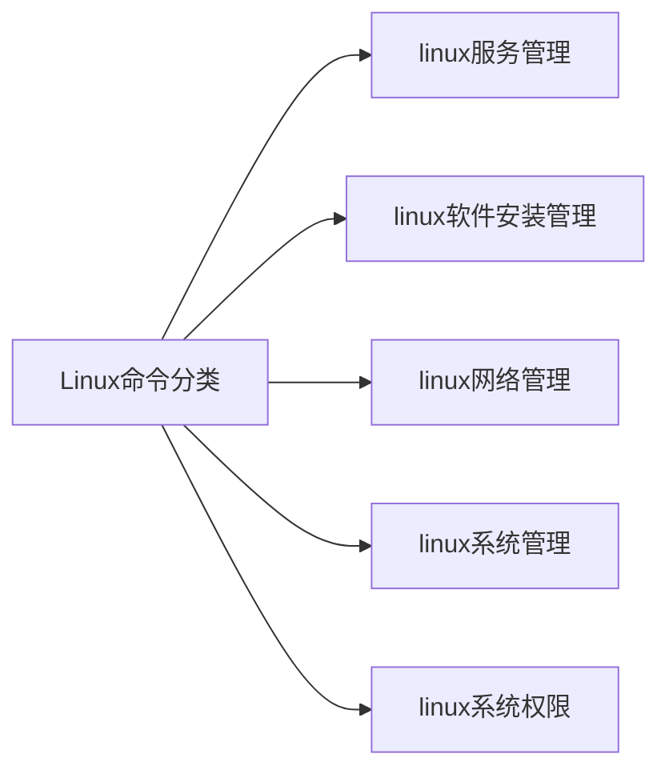
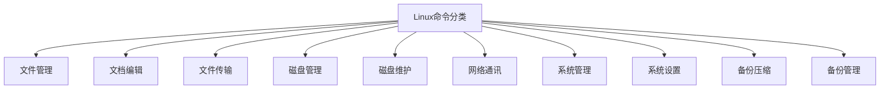

# 前言

在这个只有cangls和小白两人的小房间中，展开了一次关于学习方法的讨论。

**小白**：cangls啊，我想请教一个问题，您是如何记住那么多linux命令的。

**cangls**：我啊，别人都看我的小电影，我也不知道啊！可能是举的例子多了，就记住了一些呗。

此次写作灵感源于一本心理学方面的书籍，对话体的方式运用得当，确实很吸引人。

灵魂拷问？新手如何学linux？如何从新手到熟手？如何玩转linux？linux大神如何掌握那么多命令？趣味学习linux，了解一下。基于实战演练，同时突出重点。2万5千字的长文，是否真材实料，不妨先收藏再评论。

换个角度看待这个问题，**linux大神都是从小白开始的，没有人一开始就是大神**。

只是别人**运用的比较多**，自然而然记住了更多的命令，**从而更擅长总结学习方法**。

如果你是Linux运维人员，或者是刚入门的编程人员。根据自己的工作经历以及自学总结的内容，篇幅很长，加入了不少示例代码。但很详细哟！相信你一定有所收获的。


# 正文

7年前，我还是一个连linux是个啥都不知道的笨小孩，然而现在靠着自学积累的知识也能在日常工作中满足刚需，还教会了新来的同事不少小技巧。先上点趣味性的知识，俗称扫盲，拥有一颗爱学习（闷骚）的心。


## 01 第一夜

以linux为基础将知识串联起来，加入了一些个人经验总结，仅供参考哟！当然，你可以将此篇文章推送你的亲朋好友，当做是学习linux的入门课程。

**个人建议，如果感觉建议不到位，可以忽略掉。请直接看正文，相信会有收获的**

在给别人建议的时候，希望能从他人的角度去思考。不要上来直接甩一个教程或者视频过去，这样对新人是很不友好的。

首先，我们应该养成自学的良好习惯。**最优的方法往往是去官网查阅文档**，其次通过各大论坛，再就是搜索引擎。但官方文档大体都是英文版的，小白往往也是心有余而力不足，**记得多用词典查阅并积累**。但是，现在linux有简体中文版支持，我们在搭建学习环境的时候可以选择简体中文。当你学到深处的时候，发现还是官方文档最靠谱。

**搭建环境**，**建议是真机配合虚拟机工具部署linux服务器**(Redhat系列、Ubuntu、Fedora、Debian等等)使用，放心大胆的测试，再也不用担心服务器被自己弄崩溃了。终端管理工具推荐tabby（github上有），虽然目前终端不支持中文字符输入，但它是开源免费的。关于以何种linux的发行版进行学习，希望不要去跟风，听风就是雨，要根据自身实际情况而定。如果非要我推荐，那就是推荐Redhat系列的Centos或者Ubuntu系列，教程和资源多呗。给出我之前写的稀烂的教程**linux养成达人之入门实践图文超详细**（工欲善其事，必先利其器篇），希望对你有所帮助（**基于centos6.5的**）：

[https://blog.csdn.net/Tolove_dream/article/details/103823216](https://blog.csdn.net/Tolove_dream/article/details/103823216)

关于centos7的可以参考这篇文章：

[https://blog.csdn.net/Tolove_dream/article/details/116085467](https://blog.csdn.net/Tolove_dream/article/details/116085467)

**接着说linux简体中文版**，优势在于我看帮助命令的时候有一部分是中文的，这就对我们的学习有大大大的好处。当你提这个问题的时候，应该是对linux这个极具魅力的操作系统有很大的兴趣。有兴趣那就好办了，你会思考如何学习对自己更为有利。此时就会去翻阅文档，**最后发现还是官方文档最为有用，学会积累经验**。慢慢的从小白到老手，这之间有一段艰难的路需要独自走完，享受这一过程的美妙之处。

曾经你是不是在各大论坛或者博客网站都能看到这样一些内容，从删库到跑路。全球绝大部分的服务器啊，基本上都是采用linux服务器的，没有权限你还想删库到跑路？**当然只是开个玩笑，咱都是遵纪守法的五好青年**。

前面的删库到跑路，只是为了引出linux另一大魅力所在权限足够透明。如果在权限这方面玩的相当熟练，**那你可以存不少cang老师的作品哟**。我能自己欣赏，别人却看不到，想想就刺激。谈到cang老师，大家满眼放光聚精会神直呼内行。咱就皮一下，这不是为了引起你学习的兴趣吗。

做了很多铺垫，这里就详细的聊聊我自己的学习过程。将以对话形式展示，小白与cangls日日夜夜的对话。cangls是啥？别问我，问就是不知道，只可意会不可言传。

### 一、学习方法的探讨

在这个只有cangls和小白两人的小房间中，展开了一次关于学习方法的讨论。

**小白**：cangls啊，我想请教一个问题，您是如何记住那么多linux命令的。

**cangls**：我啊，别人都看我的小电影，我也不知道啊！可能是举的例子多了，就记住了一些呗。

**小白**：是这样啊！那能具体说说吗，我很感兴趣。

**cangls**：好啊，那咱就互相探讨探讨。

这这这，啥情况？我怀疑你两不仅在开车，而且还搞颜色，还超速了。好了，玩归玩闹归闹，言归正传。

**小白**：我想查看一下以前放的学习资料(小电影)

**cangls**：使用ls命令即可查看目录和文件**。**

```bash
# 不带参数
$ ls
# -a参数，查询所有，包含带.隐藏的
$ ls -a
# -l参数，长格式显示：显示所属组、所有者，修改时间以及文件名
$ ls -l
```

**小白**：我想给文件夹改个名字，羞羞。

**cangls**：好办，使用mv命令就能处理。

```bash
$ mv cangls  bols
```

**小白**：那我想移动到另一个文件夹呢？

**cangls**：同样可以使用mv命令，但要接路径哟！

```bash
$ mv /opt/cangls  /home/cangls/av
```

**小白**：cangls呀，我目前存的文件过多，想集中分类处理。

**cangls**：你是想，将多个文件存放到同一个目录吧。mkdir命令新建文件夹可以满足你，记得用上面的mv命令转移学习资料。

```bash
$ mkdir  /home/cangls/av
```

此时的小白看了看时间，已经记不起这是多少次来请教cangls了。cangls教了小白一个很鸡肋的但很实用的命令。

**cangls**：小白啊，知道今天是今年的第多少天吗？

**小白**：我不记得了，看看手机就知道了。

**cangls**：不用那么麻烦，用linux自带的命令cal即可查看。

```bash
$ cal -jy
```

**cangls此时看小白兴趣不减反增，于是介绍了帮助命令help和man来方便小白自学。**

上面的对话形式，是不是很有趣。当你心烦意乱的时候，不妨静下心来试试。找一个自己感兴趣的方向，去验证这些命令。如果你感兴趣的话，我之前写的部分文章也许会对你有一定的帮助。

cangls和小白的对话并没有结束，在这个只有两人的小房间中，到底发生了啥，请接着看。

## 02 第二夜

第一夜对学习方法进行了探讨，如何一步步提升自己学习的兴趣。第二夜cangls与小白继续展开关于linux基本命令的讨论。

**cangls**：小白啊，你来了，看来还是有不少疑问吧！

**小白**：是的，虽然上次你说了一些关于linux的帮助命令，我还是有些摸不着头脑。

**cangls**：没关系，下面我给你带来了详细的帮助命令的讲解，学习方法很重要哟！

小白此时拿出了自己的小本本，开始记录了起来...

### 二、基本命令的探讨

**注意**：#符号表示root用户登录，$符号表示普通用户登录。

#### 1、帮助命令（重点）

这种方法是其中一种手段，将其输出到某个文件，然后总结起来。再**通过scp命令传到本地记录到小本本上**。

```bash
[root@cnwangk ~]# ls --help > helpcmd.txt
[root@cnwangk ~]# man ls >> helpcmd.txt
#借助本地的终端管理工具，使用scp命令取到Windows本地桌面，即从远程传回本地
$ scp root@192.168.245.131:/root/helpcmd.txt ~/Desktop/
root@192.168.245.131's password:
helpcmd.txt                                                                                              100%   21KB   3.8MB/s   00:00
```

**注意**：>符号是重定向输入会覆盖原始文件的内容，>>符号也是重定向输入到指定文件，但是是追加进去。

##### 1.1、help命令

如下所示，直接输入help命令就会输出很多提示，或者在使用的命令后面加上参数`--help`进行操作。

```bash
$ help
$ ls --help
```

上面的第一条命令代表着直接输入help命令，也会反馈一些帮助文档出来。第二种方式，则是以具体的命令`ls`使用`--help`帮助命令获取指定命令的帮助文档。

##### 1.2、man命令

###### 1.2.1、man的级别作用

| 参数 | 作用                                       |
| ---- | ------------------------------------------ |
| 1    | 查看命令的帮助                             |
| 2    | 查看可被内核调用的函数的帮助               |
| 3    | 查看函数和函数库的帮助                     |
| 4    | 查看特殊件的帮助（主要是/dev目录下的文件） |
| 5    | 查看配置文件的帮助                         |
| 6    | 查看游戏的帮助                             |
| 7    | 查看其它杂项的帮助                         |
| 8    | 查看系统管理员可用命令的帮助               |
| 9    | 查看和内核相关文件的帮助                   |

例如：**查看passwd的配置文件帮助、查看null的特殊件的帮助、查看ifconfig系统管理员可用命令的帮助**。

```bash
$ man 5 passwd
$ man 4 null
$ man 8 ifconfig 
```

`man` 命令，**获取指定命令的帮助**，展示ls命令全部内容帮助手册。

```bash
$ man ls
```

查看命令拥有哪个级别的帮助,`man -f` 命令相当于`whatis`命令。

```bash
$ man -f
[root@cnwangk ~]# man -f
whatis 什么？
$ whatis
```

查看命令相关的所有帮助。`man -k` 命令，相当于`apropos` 命令。例如：

```bash
$ man -k
$ apropos
#查看passwd的帮助命令
$ apropos passwd
```

###### 1.2.2、man命令的详细展示

直接在终端输入man命令，会提示您需要什么手册页？这里以查看ls命令的帮助手册为例子进行讲解示例说明，列举了部分示例。

**tips**：输入q直接退出帮助手册。

```bash
[root@cnwangk ~]# man
您需要什么手册页？ 
#进入ls命令的帮助文档
$ man ls 
LS(1)                              General Commands Manual                                                   LS(1)
NAME
       ls, dir, vdir - 列目录内容
提要
       ls [选项] [文件名...]
       POSIX 标准选项: [-CFRacdilqrtu1]
GNU 选项 (短格式):
       [-1abcdfgiklmnopqrstuxABCDFGLNQRSUX] [-w cols] [-T cols] [-I pattern] [--full-time] [--format={long,verbose,commas,across,verti‐
       cal,single-column}] [--sort={none,time,size,extension}] [--time={atime,access,use,ctime,status}]  [--color[={none,auto,always}]]
       [--help] [--version] [--]
描述（ DESCRIPTION ）
       程序ls先列出非目录的文件项，然后是每一个目录中的“可显示”文件。如果  没有选项之外的参数【译注：即文件名部分为空】出现，缺省为 "."（当前目录）。 选项“ -d ”使得目录与非目录项同样对待。除非“ -a ” 选项出现，文 件名以“.”开始的文件不属“可显示”文件。
       以当前目录为准，每一组文件（包括非目录文件项，以及每一内含文件的目录）分别按文件名比较顺序排序。如果“-l”选项存在，每组文件前显示一摘要行: 给出该组文件长度之和（以 512 字节为单位）。
       输出是到标准输出（stdout）。除非以“-C”选项要求按多列输出，输出将是一行一个。然而，输出到终端时，单列输出或多列输出是不确定的。可以分别 用选项“ -1 ” 或“ -C ”来强制按单列或多列输出。
       -C     多列输出，纵向排序。
       -F     每个目录名加“ / ”后缀，每个 FIFO 名加“ | ”后缀， 每个可运行名加“ * ”后缀。
       -R     递归列出遇到的子目录。
       -a     列出所有文件，包括以 "." 开头的隐含文件。
```

以上就是`man`帮助命令的讲解，相信你会爱上linux中的帮助命令的。这回该明白了，linux大神是如何记住那么多命令的吧！

#### 2、常见目录作用的探讨

| 选项        | 作用                                     |
| ----------- | ---------------------------------------- |
| **/**       | **根目录**                               |
| /`bin`      | 命令保存目录（普通用户就可以读取的命令） |
| /boot       | 启动目录，启动相关文件                   |
| /`dev`      | 设备文件保存目录                         |
| **/etc**    | **配置文件保存目录**                     |
| **/home**   | **普通用户的家目录**                     |
| /lib        | 系统库保存目录                           |
| /mnt        | 系统挂载目录                             |
| /media      | 挂载目录                                 |
| **/`root`** | **超级用户的家目录**                     |
| /tmp        | 临时目录                                 |
| /`sbin`     | 命令保存目录（超级用户才能使用的目录）   |
| /proc       | 直接写入内存                             |
| /sys        |                                          |
| **/usr**    | **系统软件资源目录**                     |
| /usr/bin    | 系统命令（普通用户）                     |
| /usr/sbin   | 系统命令（超级用户）                     |
| /`var`      | 系统相关文档内容                         |


#### 3、最常用的命令总结

##### 3.1、学习方法小结

最常用的命令往往也是最基本的命令，这里也同样以增删改查（CURD）进行讲解。如果要人为的细分，这里给出一种学习的思路，可以按照如思维导图所示：



当然也可以按照如下方式去总结：



列举一些常用的命令，先做简单的介绍，在脑海中有个印象。下面继续做详细介绍。

```bash
$ ls #查看文件和目录
$ ll #等价于ls -l
$ cat #查看具体内容
$ cd #切换目录
$ mkdir # 新建文件夹
$ touch # 新建文件
$ cp #复制文件
$ mv #移动或者重命名文件
$ vim #linux下的一种编辑文件的手段，文中会详细介绍。
$ rm #删除文件
$ chmod #赋予权限
$ chown #改变文件所有者
```

##### 3.2、命令详细介绍

**ls命令**，查看目录以及文件命令，下面不会全部展示出来，只**展示一部分内容**。

```bash
#不带任何参数
[root@cnwangk ~]# ls
anaconda-ks.cfg  av  cangls.av  history.txt  scp_test
#加上参数-l，使用较长格式列出信息
[root@cnwangk ~]# ls -l
drwxr-xr-x  2 root root    23 1月   4 20:21 av
-rw-r--r--  1 root root    10 1月   4 20:16 cangls.av
# -a参数，不隐藏任何以. 开始的项目
[root@cnwangk ~]# ls -a
.  .bash_history  .bash_profile  .cache  .config ..  av  .bash_logout   .bashrc   cangls.av  .ssh  .viminfo
```

**ll命令**，是ls -l的缩略形式，相当于起了别名。以长格式列出信息，包含权限、文件所有者、日期、文件名。

```bash
$ ll
drwxr-xr-x  2 root root    23 1月   4 20:21 av
-rw-r--r--  1 root root    10 1月   4 20:16 cangls.av
-rwxr-xr-x  1 root root    78 1月  19 21:23 hello.sh
```

**cat命令**，查看文件的内容，新建了一个hello.sh脚本作为演示，展示脚本的内容。

```bash
[root@cnwangk ~]# cat hello.sh 
#!/bin/bash
echo "hello cangls"
echo hello linux
echo create btrfs filesystem
```

**cd命令**，这个就不用做过多介绍，大家都很熟悉这个命令了。

```bash
#切换到opt目录下
$ cd /opt
#返回上一层
$ cd ..
#进入当前用户家目录
$ cd ~
```

**mkdir命令**，新建目录，新建一个cangls的合集目录。

```bash
[root@cnwangk ~]# mkdir canglsList
[root@cnwangk ~]# ls
anaconda-ks.cfg  cangls.av  canglsList  hello.sh 
```

**touch命令**，新建一个cangls.avi文件

```bash
$ touch cangls.avi
```

**cp命令**，复制命令，可以是单个文件也可以是目录。将cangls.avi文件复制到新建的canglsList目录中。

```bash
[root@cnwangk ~]# cp cangls.avi /root/canglsList/
[root@cnwangk ~]# ls /root/canglsList/ #查看复制后cangls文件集合目录
cangls.avi
```

**mv命令**，移动或者重命名。当文件路径相同时，我们就会修改重命名；不同路径时，则为剪切。我将cangls.avi文件重命名为acngls.mp4。然后将cangls.mp4文件移动到canglsList目录下。

```bash
[root@cnwangk ~]# mv cangls.avi cangls.mp4
[root@cnwangk ~]# ls
anaconda-ks.cfg  av  cangls.av  canglsList  cangls.mp4  hello.sh
[root@cnwangk ~]# mv cangls.mp4 /root/canglsList/
[root@cnwangk ~]# ls
anaconda-ks.cfg  av  cangls.av  canglsList  hello.sh  history.txt  scp_test
[root@cnwangk ~]# ls /root/canglsList/
cangls.avi  cangls.mp4
```

最终查看在/root/目录下cangls.mp4部件了，此时已经被我移动到canglsList集合目录中了。

**vim命令**，这里做简单演示，下面会做详细的说明。输入hello cangls，使用cat展示内容。

```bash
[root@cnwangk ~]# vim /root/canglsList/cangls.avi
[root@cnwangk ~]# cat /root/canglsList/cangls.avi
hello cangls
```

**rm命令**，删除命令。演示，删除cangls.av文件。

```bash
[root@cnwangk ~]# ls #查看我有cangls.av这个文件
anaconda-ks.cfg  av  cangls.av  canglsList  hello.sh
[root@cnwangk ~]# rm cangls.av #删除，需要输入确认
rm：是否删除普通文件 "cangls.av"？y
[root@cnwangk ~]# rm -rf cangls.av  #强制删除，并递归删除，不需要确认
[root@cnwangk ~]# ls
anaconda-ks.cfg  av  canglsList  hello.sh
```

**chmod命令**，简单的介绍赋予权限命令，一般755和644比较常用的。给cangls.sh输入点内容，然后赋予权限。

```bash
[root@cnwangk ~]# echo echo "hello cangls" > cangls.sh 
[root@cnwangk ~]# cat cangls.av 
hello cangls
[root@cnwangk ~]# ll #查看cangls.sh脚本权限
-rw-r--r--  1 root root    13 1月  19 22:50 cangls.sh
[root@cnwangk ~]# chmod 755 cangls.sh 
[root@cnwangk ~]# ll #对比权限变为了rwx-rx-rx，对应数字就是755
-rwxr-xr-x  1 root root    13 1月  19 22:50 cangls.sh
#执行脚本cangls.sh
[root@cnwangk ~]# ./cangls.sh 
hello cangls
```

**chown命令**，改变文件所有者，将cangls.sh文件所以者从root改为test用户。

```bash
[root@cnwangk ~]# chown test cangls.sh 
[root@cnwangk ~]# ll
-rwxr-xr-x  1 test root    18 1月  19 22:55 cangls.sh
```

个人根据多年经验总结，认为工作中最最最常用的一些命令，以上就列举这么多了。还有其它常用命令，请接着往下阅读。

#### 4、其它常用命令

##### 4.1、 挂载命令格式
`mount` [-t 文件系统] [-o 特殊选项] 设备文件名 挂载点

| 参数 | 作用                                                         |
| ---- | ------------------------------------------------------------ |
| -t   | 文件系统，加入系统文件类型来指定挂载的类型，可以是ext3、ext4、iso9660、**xfs**、**btrfs**等文件系统 |
| -o   | 特殊选项，可以指定挂载的额外选项                             |

##### 4.2、查询与挂载

查询系统中已经挂载的设备，`mount`命令。

```bash
#查询系统中已经挂载的设备
$ mount
#列举我自己测试环境下已经挂载的部分设备，Redhat7系列
#我测试使用是btrfs文件系统
/dev/sdb2 on /data type btrfs (rw,relatime,space_cache,subvolid=5,subvol=/)
#系统默认挂载所使用文件系统格式xfs
/dev/sda2 on /home type xfs (rw,relatime,attr2,inode64,noquota)
/dev/sda1 on /boot type xfs (rw,relatime,attr2,inode64,noquota)
```

上面列举我自己测试环境下已经挂载的部分设备，Redhat7系列。顺带一提，Redhat7开始推荐使用xfs文件系统，我所演示的也包含了`xfs`文件系统挂载的，同样也有上面介绍过的`btrfs`文件系统。

部分参数说明，如下表格所示：

| 参数          | 作用                                                         |
| ------------- | ------------------------------------------------------------ |
| mount  -a     | 依据配置文件`/etc/fstb`的内容，自动挂载                      |
| atime/noatime | 更新访问时间/不更新访问时间。访问分区文件时，是否更新文件的访问时间，默认为更新。 |
| async/sync    | 异步/同步，默认为异步                                        |
| auto/noauto   | 自动/手动，执行mount -a命令时，是否会自动安装/etc/fstb文件内容挂载，默认自动。 |
| defaults      | 定义默认值，相当于`rw`，`suid`，`dev`，`exec`，`auto`，`nouser`，`async`这七个选项。 |
| exec/noexec   | 执行/不执行，设定是否允许在文件系统中执行可执行文件，默认exec允许。 |
| remount       | 重新挂载已挂载的文件系统，一般用于指定修改特殊权限。         |
| rw/ro         | 读写/只读，文件系统挂载时，是否具有读写权限，**默认**rw。    |
| suid/nosuid   | 具有/不具有suid权限，设定文件系统是否具有suid和sgid的权限，**默认具有**。 |
| user/nouser   | 允许/不允许普通用户挂载，设定文件系统是否允许普通用户挂载，默认不允许，只有`root`可以挂载分区。 |
| usrquota      | 写入代表文件系统支持用户磁盘配额，默认不支持。               |
| grpquota      | 写入代表文件系统支持组磁盘配额，默认不支持。                 |

**关于磁盘挂载，如果感兴趣的话**，可以参考我在github或者gitee上整理的文章。在代码库中的linux文件夹中，同样整理了PDF文件格式的文章便于阅读，目前还在整理完善中。

**个人github仓库地址**，一般会先更新PDF文件，然后再上传markdown文件。如果访问github太慢，可以访问gitee进行克隆。

[https://github.com/cnwangk/SQL-study](https://github.com/cnwangk/SQL-study)

**4.2.1、挂载光盘**

首先建立挂载点，命令如下：

```bash
$ mkdir /mnt/cdrom/
```

挂载光盘，这里说明下：只是习惯在mnt下建立，media下建立也行。

简单介绍：/dev/sr0是要挂载的文件，/mnt/cdrom是挂载存储的磁盘路径

```bash
$ mount -t iso9660 /dev/cdrom /mnt/cdrom/
$ mount /dev/sr0  /mnt/cdrom/
```

卸载命令，设备文件名或者挂载点，比如卸载新增磁盘挂载的sdb

```bash
$ umount /dev/sdb 
```

**4.2.2、挂载U盘**

查看U盘设备文件名，`fdisk -l`查看磁盘列表

```bash
$ fdisk -l 
$ mount -t vfat /dev/sdb1 /mnt/usb/
```


##### 4.3、用户登录查看命令

查看用户登录信息

```bash
$ w
[root@cnwangk ~]# w
 21:31:12 up  1:39,  1 user,  load average: 0.00, 0.04, 0.05
USER     TTY      FROM             LOGIN@   IDLE   JCPU   PCPU WHAT
root     pts/0    192.168.245.1    19:52    0.00s  0.28s  0.02s w
```

如上所示，输入w命令查看到我的登录信息。只有1个用户，我用ssh登录的，本机虚拟机中并没有登录。命令输出如下所示：

**4.3.1、命令输出**

参数说明，作用如下表格所示：

| 参数   | 作用                                                         |
| ------ | ------------------------------------------------------------ |
| USER   | 登录的用户名                                                 |
| TTY    | 登录终端                                                     |
| FROM   | 从哪个IP地址登录                                             |
| LOGIN@ | 登录时间                                                     |
| DILE   | 用户闲置时间                                                 |
| JCPU   | 与该终端连接的所有进程占用的时间。这个时间里并不包括过去的后台作业时间，但包括当前正在运行的后台作业占用时间 |
| PCPU   | 当前进程所占用时间                                           |
| WHAT   | 当前正在运行的命令                                           |
| w      | 查询登录用户，显示系统时间和运行时间，用户个数以及平均负载。 |

**4.3.2、查看登录用户信息**

命令输出：用户名，登录终端，登录时间（登录来源IP地址）

```bash
#查看用户信息
$ who
[root@cnwangk ~]# who  #查看当前用户信息
root     pts/0        2022-01-19 19:52 (192.168.245.1)
#查看当前用户
$ whoami #查看当前用户身份是root
[root@cnwangk ~]# whoami 
root
```

查看到当前用户为root，登录终端pts/0，登录时键与IP：2022-01-19 19:52 (192.168.245.1)，**虚拟机搭建的环境**。

**查询当前登录和过去登录的用户信息**

last命令默认读取`/var/log/wtmp`文件数据 。命令输出：用户名，登录终端，登录IP，登录时间，退出时间（在线时间）

```bash
$ last
root     tty1                          Sun Jan  5 21:47 - 21:50  (00:02)    
reboot   system boot  3.10.0-514.el7.x Sun Jan  5 21:44 - 21:59 (7+00:15)  
```

可以看到记录的我最久远的一次登录信息，时间确实有点久了，基本上很晚才使用的。

**查看所有用户最后一次登录时间**

```bash
#lastlog命令默认读取/var/log/lastlog文件内容
#命令输出：用户名，登录终端，登录IP，最后一次登录时间
$ lastlog
[root@cnwangk ~]# lastlog 
用户名           端口     来自               最后登陆时间
root            pts/0   192.168.245.1      三 1月 19 22:52:46 +0800 2022
bin                                        **从未登录过**
```

上面的中文显示，我在安装的时候选择了简体中文版，**对于初学者来说简直太友好了**。

**查看网络状态** ，一般比较关注的是`ESTABLISHED`状态

```bash
$ netstat -an | grep ESTABLISHED
[root@cnwangk ~]# netstat -an | grep ESTABLISHED
tcp        0      0 192.168.245.131:22      192.168.245.1:3579      ESTABLISHED
```


##### 4.4、解压缩命令

只介绍一些常用的，比如压缩命令zip、gzip；解打包命令tar。

###### 4.4.1、压缩命令

例如：zip、gzip。将canglsAVList压缩成canglsAVList.zip格式，将bolsAVList压缩成bolsAVList.gz格式。

```bash
zip -r canglsAVList > cangls.zip
gzip -c bolsAVList > bolsAVList.gz
```

###### 4.4.2、解打包命令tar

解压一个`redis`的源码包

```bash
$ tar -zxvf redis-6.0.8.tar.gz 
```

打包命令tar -zcvf，将redis-6.0.8-bak打包成tar包

```bash
$ tar -zcvf redis-6.0.8-bak > redis-6.0.8-bak.tar
```

然后再将redis-6.0.8-bak.tar压缩成.gz格式

```bash
$ gzip redis-6.0.8-bak.tar > redis-6.0.8-bak.tar.gz
```

##### 4.5、搜索命令

###### 4.5.1、locate命令

**locate命令**后面只能接文件名，例如，咱搜索一下cangls的文件。嚯，还不少啊：

```bash
locate cangls
[root@cnwangk opt]# locate cangls
/root/cangls.av
/root/cangls.sh
/root/canglsList
/root/canglsList/cangls.avi
/root/canglsList/cangls.mp4
```

locate命令所搜索的后台命令，不是及时更新，这时可以使用**updatedb命令**更新：

```bash
$ updatedb
```

locate命令配置文件`/etc/updatedb.conf`配置文件
- PRUNE_BIND_MOUNTS：开启搜索限制
- PRUNEFS=""：不搜索的系统文件
- PRUNENAMES=""：不搜索的文件类型
- PRUNEPAEHS=""：不搜索的路径

###### 4.5.2、命令搜索命令

命令搜索命令，比如**wheris、which以及find**命令。

**此处，着重讲一下find命令的使用**：

**不区分大小写**，搜索cangls.sh脚本

```bash
$ find /root -iname cangls.sh 
```

按照所有者搜索

```bash
$ find /root -user root
```

查找10天前修改的文件
```bash
find /var/log  -mtime +10
```

查找`/etc`目录下大于1M的文件
```bash
find /etc -size +1M
```

**查找i节点为26267295的文件**，直呼内行，啥时候新增了个bols的小电影。

```bash
[root@cnwangk ~]# find . -inum 26267295
./bolsList
```

查找/etc/目录下大于100KB且小于200KB的文件
```bash
find /etc -size +100k -a -size -200k
```
- -a相当于and，逻辑与，两个条件都满足
- -o相当于or，逻辑或，两个条件满足一个即可

**查找/etc/目录下大于100KB且小于200KB的文件，并且显示详细信息**

```bash
#-exec/-ok 命令 
#{}\;对搜索结果执行操作
find /etc -size +100k -a -size -200k -exec ls -lh {} \;
```

**grep**字符串搜素命令

- grep [选项] 字符串 文件名，在文件当中匹配符合的字符串
- -i，忽略大小写
- -v，排除指定字符串

**根据文件大小匹配**，anaconda-ks.cfg文件时Redhat系列安装就自带的文件。

```bash
$ grep "size" anaconda-ks.cfg
part swap --fstype="swap" --ondisk=sda --size=2000
part /boot --fstype="xfs" --ondisk=sda --size=200
part / --fstype="xfs" --ondisk=sda --size=16278
part /home --fstype="xfs" --ondisk=sda --size=2000
```

**find与grep的区别**

- find命令：在系统当中搜索符合条件的文件名，如需匹配，**使用通配符，通配符是完全匹配**。
- grep命令：在文件当中搜索符合条件的字符串，如需匹配，**使用正则表达式进行匹配，正则表达式是包含匹配**。

#### 5、关机与重启命令

##### 5.1、关机命令

一般而言关机和重启命令都不会赋予权限给普通用户，只有root用户才有权限执行。

```bash
$ shutdown
# shutdown -h now #立即关机
```

| 参数 | 作用               |
| ---- | ------------------ |
| -c   | 取消前一个关机命令 |
| -h   | 关机               |
| -r   | 重启               |

其它关机命令：halt，poweroff，init 0

**注意**：使用服务器时，不要随便去使用关机命令。一旦使用了，会造成不必要的麻烦。

##### 5.2、重启命令

一般而言关机和重启命令都不会赋予权限给普通用户，只有root用户才有权限执行。

```bash
#重启命令1,立即重启，同样可以接指定世界以及间隔多久重启
$ shutdown -r now
#重启命令2,立即重启
$ reboot
```

**注意**：使用`logout`命令登出shell，**养成良好的习惯退出登录**

其它重启命令：reboot，init 6

## 03 第三夜

第二夜的知识有点多，小白还有点没消化过来。

**cangls**：小白，你来啦。我白吗？我大吗？我好看吗？别走了，我这里...

**小白**：啥？一脸懵逼...

此时小白的内心真实想法：不要以为我不懂，咱为学习忍了。真的又大又白，天天诱惑我。

**cangls**：不逗你玩了，咱回到正题，昨天的知识点有点多，希望下去好好消化。今天会带来linux进阶方面的小技巧。

**小白**：点了点头，认真的聆听着。

### 三、进阶常用

#### 1、scp命令

##### 1.1、语法

```powershell
usage: scp [-12346BCpqrv] [-c cipher] [-F ssh_config] [-i identity_file]
           [-l limit] [-o ssh_option] [-P port] [-S program]
           [[user@]host1:]file1 ... [[user@]host2:]file2
```
##### 1.2、使用方法
**简单来看**：scp [可选参数] 本地文件 目标目录

```bash
scp /root/av/local_file.av  remote_username@ip:/root/av
```

scp [可选参数] 本地目录 目标目录

```bash
scp -r /root/av/  remote_username@ip:/root/
```
**命令格式介绍**

```bash
#复制文件格式,本地到远程服务器
scp local_file remote_username@remote_ip:remote_directory 
#或者 
scp local_file remote_username@remote_ip:remote_file 
#或者 
scp local_file  remote_ip:remote_directory 
#或者 
scp local_file remote_ip:remote_file 
```

**复制目录命令格式**

```bash
#复制命令格式,本地到远程服务器
scp -r local_directory remote_username@remote_ip:remote_directory 
#或者 
scp -r local_directory remote_ip:remote_directory 
```

详细操作，请参考的博文：**【SCP命令】安全又快捷的linux小技巧scp命令**

#### 2、路由命令

以下是对一些常用的路由命令（网络配置工具）进行简单的介绍。

2.1、**ifconfig命令**，展示内容如下：

**tips**：我们判断网络环境的时候，**dropped**参数值是很重要的，**一般正常状态是0，如果掉包数字则会上升**。

```bash
[root@cnwangk ~]# ifconfig 
docker0: flags=4099<UP,BROADCAST,MULTICAST>  mtu 1500
        inet 172.17.0.1  netmask 255.255.0.0  broadcast 172.17.255.255
        ether 02:42:38:38:ab:fe  txqueuelen 0  (Ethernet)
        RX packets 0  bytes 0 (0.0 B)
        RX errors 0  dropped 0  overruns 0  frame 0
        TX packets 0  bytes 0 (0.0 B)
        TX errors 0  dropped 0 overruns 0  carrier 0  collisions 0

ens33: flags=4163<UP,BROADCAST,RUNNING,MULTICAST>  mtu 1500
        inet 192.168.245.131  netmask 255.255.255.0  broadcast 192.168.245.255
        inet6 fe80::b314:8248:917a:d808  prefixlen 64  scopeid 0x20<link>
        ether 00:0c:29:47:be:5f  txqueuelen 1000  (Ethernet)
        RX packets 14160  bytes 1053042 (1.0 MiB)
        RX errors 0  dropped 0  overruns 0  frame 0
        TX packets 7652  bytes 713027 (696.3 KiB)
        TX errors 0  dropped 0 overruns 0  carrier 0  collisions 0

lo: flags=73<UP,LOOPBACK,RUNNING>  mtu 65536
        inet 127.0.0.1  netmask 255.0.0.0
        inet6 ::1  prefixlen 128  scopeid 0x10<host>
        loop  txqueuelen 1  (Local Loopback)
        RX packets 1474  bytes 91198 (89.0 KiB)
        RX errors 0  dropped 0  overruns 0  frame 0
        TX packets 1474  bytes 91198 (89.0 KiB)
        TX errors 0  dropped 0 overruns 0  carrier 0  collisions 0
```

**ifconfig最常见的作用就是看设置的ip地址以及dns和网关**，其实就是看网卡设置的参数。当你看到docker的时候，没错，我安装了docker环境。

2.2、**ip命令使用**，如下所示：

```bash
[root@cnwangk ~]# ip addr list
1: lo: <LOOPBACK,UP,LOWER_UP> mtu 65536 qdisc noqueue state UNKNOWN group default qlen 1
    link/loopback 00:00:00:00:00:00 brd 00:00:00:00:00:00
    inet 127.0.0.1/8 scope host lo
       valid_lft forever preferred_lft forever
    inet6 ::1/128 scope host 
       valid_lft forever preferred_lft forever
2: ens33: <BROADCAST,MULTICAST,UP,LOWER_UP> mtu 1500 qdisc pfifo_fast state UP group default qlen 1000
    link/ether 00:0c:29:47:be:5f brd ff:ff:ff:ff:ff:ff
    inet 192.168.245.131/24 brd 192.168.245.255 scope global noprefixroute ens33
       valid_lft forever preferred_lft forever
    inet6 fe80::b314:8248:917a:d808/64 scope link noprefixroute 
       valid_lft forever preferred_lft forever
3: docker0: <NO-CARRIER,BROADCAST,MULTICAST,UP> mtu 1500 qdisc noqueue state DOWN group default 
    link/ether 02:42:38:38:ab:fe brd ff:ff:ff:ff:ff:ff
    inet 172.17.0.1/16 brd 172.17.255.255 scope global docker0
       valid_lft forever preferred_lft forever
#ip命令同样可以配合route命令使用       
[root@cnwangk ~]# ip route list 
default via 192.168.245.2 dev ens33 proto static metric 100 
172.17.0.0/16 dev docker0 proto kernel scope link src 172.17.0.1 
192.168.245.0/24 dev ens33 proto kernel scope link src 192.168.245.131 metric 100        
```

ip命令同样可以配合route命令使用，单独使用route命令同样可以起到配置作用。

下图是我之前制作的一个简单的思维导图，本来是要放在防火墙知识里面的，现在同样适用。没有放原图，原图太大了，缩小了一点也同样能看清楚哟！


#### 3、防火墙命令

这里，我只介绍firewalld命令行模式，关于详细操作说明请参考博文：**【Redhat系列linux防火墙工具】firewalld与iptables防火墙工具的激烈碰撞**

##### 1.1、区域选择

当前操作系统安装完成后，防火墙会设置一个默认区域，将接口加入到默认区域中。用户配置防火墙的第一步是获取默认区域并修改，关于操作如下：

查看当前系统中所有区域
```powershell
firewall-cmd --get-zones
```
查看当前默认的区域
```powershell
firewall-cmd --get-default-zone
```
查看当前已激活的区域
```powershell
firewall-cmd --get-active-zones
```
获取接口ens33所属区域
```powershell
firewall-cmd --get-zone-of-interface=ens33
```
修改接口所属区域
```powershell
firewall-cmd --permanent --zone=internal --change-interface=ens33
```

##### 1.2、firewalld服务管理
重新加载防火墙配置
```powershell
firewall-cmd --reload
```

重启防火墙(redhat系列)
```powershell
systemctl restart firewalld.service
```

临时关闭防火墙
```powershell
systemctl stop firewalld.service
```
开机启用防火墙
```powershell
systemctl enable firewalld.service
```
开机禁止防火墙
```powershell
systemctl disable firewalld.service
```

查看firewalld的运行状态
```powershell
firewall-cmd --state
```


##### 1.3、firewalld开放端口
公共区域（public）设置开放21端口永久生效并写入配置文件（参数：--permanent）
```powershell
#参数：--permanent，设置即立刻生效并且写入配置文件
firewall-cmd --zone=public --add-port=21/tcp --permanent
```

查询防火墙端口21是否开放
```powershell
firewall-cmd --zone=public --query-port=21/tcp
```

移除开放的端口21
```powershell
firewall-cmd --zone=public --remove-port=21/tcp --permanent
```


##### 1.4、区域规则修改

查询防火墙规则列表
```powershell
firewall-cmd --zone=public --list-all
```
新增一条区域规则httpd服务
```powershell
firewall-cmd --permanent --zone=internal --add-service=http
```
验证规则
```powershell
firewall-cmd  --zone=internal --list-all
```

#### 4、进程相关命令

进程相关命令主要介绍四个

- ps -aux | grep [服务名]
- ps -ef | grep [服务名]
- ps -le | grep [服务名]
- top

如果没有安装httpd服务，Redhat系列可以使用yum命令进行安装，在Ubuntu系列可以通过`apt install`。apt 是 Debian 和 Ubuntu 中的 Shell 前端软件包管理器。

```bash
$ yum -y install httpd
```

查看进程常用的ps命令，以httpd进程进行演示。这里只介绍工作中比较实用的。

```bash
#使用-ef参数查看httpd进程
$ ps -ef | grep httpd
[root@cnwangk ~]# ps -ef | grep httpd
root      1329     1  0 13:37 ?        00:00:00 /usr/sbin/httpd -DFOREGROUND
apache    2216  1329  0 13:37 ?        00:00:00 /usr/sbin/httpd -DFOREGROUND
apache    2218  1329  0 13:37 ?        00:00:00 /usr/sbin/httpd -DFOREGROUND
apache    2219  1329  0 13:37 ?        00:00:00 /usr/sbin/httpd -DFOREGROUND
apache    2220  1329  0 13:37 ?        00:00:00 /usr/sbin/httpd -DFOREGROUND
apache    2221  1329  0 13:37 ?        00:00:00 /usr/sbin/httpd -DFOREGROUND
apache    2222  1329  0 13:37 ?        00:00:00 /usr/sbin/httpd -DFOREGROUND
root      2276  2226  0 13:38 pts/0    00:00:00 grep --color=auto httpd
#使用-aux参数查看httpd进程
$ ps -aux | grep httpd
[root@cnwangk ~]# ps -ef | grep httpd
root      1329     1  0 13:37 ?        00:00:00 /usr/sbin/httpd -DFOREGROUND
apache    2216  1329  0 13:37 ?        00:00:00 /usr/sbin/httpd -DFOREGROUND
apache    2218  1329  0 13:37 ?        00:00:00 /usr/sbin/httpd -DFOREGROUND
apache    2219  1329  0 13:37 ?        00:00:00 /usr/sbin/httpd -DFOREGROUND
apache    2220  1329  0 13:37 ?        00:00:00 /usr/sbin/httpd -DFOREGROUND
apache    2221  1329  0 13:37 ?        00:00:00 /usr/sbin/httpd -DFOREGROUND
apache    2222  1329  0 13:37 ?        00:00:00 /usr/sbin/httpd -DFOREGROUND
root      2276  2226  0 13:38 pts/0    00:00:00 grep --color=auto httpd
#以长格式查询httpd进程
$ ps -le | grep httpd
[root@cnwangk ~]# ps -le | grep httpd
4 S     0  1329     1  0  80   0 - 104198 poll_s ?       00:00:00 httpd
5 S    48  2216  1329  0  80   0 - 70677 poll_s ?        00:00:00 httpd
5 S    48  2218  1329  0  80   0 - 105278 SYSC_s ?       00:00:00 httpd
5 S    48  2219  1329  0  80   0 - 105278 ep_pol ?       00:00:00 httpd
5 S    48  2220  1329  0  80   0 - 105278 SYSC_s ?       00:00:00 httpd
5 S    48  2221  1329  0  80   0 - 105278 SYSC_s ?       00:00:00 httpd
5 S    48  2222  1329  0  80   0 - 105278 SYSC_s ?       00:00:00 httpd
```

查看进程，当然**top命令**也应该了解，不带任何参数就能看到一些进程相关的。比如服务器当前时间、运行天数、用户数量、负载均衡、任务总数、多少进程在运行和休眠、停止以及僵尸进程**zombie**、cpu的利用率、内存占用情况以及缓存、缓冲的情况。查看直接使用top即可，退出按q键。

```bash
$ top
top - 13:41:24 up 5 min,  1 user,  load average: 0.06, 0.28, 0.16
Tasks: 193 total,   1 running, 192 sleeping,   0 stopped,   0 zombie
%Cpu(s):  0.3 us,  0.7 sy,  0.0 ni, 98.7 id,  0.3 wa,  0.0 hi,  0.0 si,  0.0 st
KiB Mem :  1877588 total,   940396 free,   481804 used,   455388 buff/cache
KiB Swap:  2047996 total,  2047996 free,        0 used.  1235960 avail Mem 
```

查看进程，**pstree命令**也必不可少，以树状结构展示出了我部署的**vsftpd**以及监控系统服务**zabbix**。

```bash
$ pstree
        ├─vsftpd
        ├─zabbix_agentd───5*[zabbix_agentd]
        ├─zabbix_proxy
        └─zabbix_server───33*[zabbix_server]
```

进程实在无法正常结束，那就采取暴力手段**kill命令**，强行关闭。

```bash
$ kill -1 3033 #重启进程
$ kill -9 3034   #强制杀死进程
```

关于进程的就讲这么多，讲太多了不好消化，更多详细描述可以参考本人的历史博文。

#### 5、系统权限

系统权限，如果非要分类，大致可分为：**基本权限、特殊权限**。

权限分配原则：**对文件来讲：最高权限为`x`（执行）**；**对目录来讲：最高权限为`w`（写）**。接着以cangls这个文件进行演示，分别带你看权限用数字的代表含义，rwx加起来就是7：

- r 对应的数字权限为：4，读权限
- w 对应的数字权限为：2， 写权限
- x 对应的数字权限为：1，执行权限

```bash
[root@cnwangk ~]# chmod 711 cangls.av
[root@cnwangk ~]# ll cangls.av
-rwx--x--x 1 root root 13 1月  19 22:49 cangls.av
[root@cnwangk ~]# chmod 722 cangls.av
[root@cnwangk ~]# ll cangls.av
-rwx-w--w- 1 root root 13 1月  19 22:49 cangls.av
[root@cnwangk ~]# chmod 744 cangls.av
[root@cnwangk ~]# ll cangls.av
-rwxr--r-- 1 root root 13 1月  19 22:49 cangls.av
```

通过上面的演示对cangls.av这个文件赋予权限711、722、744进行测试。711对应的权限`-rwx--x--x`、722对应的权限`-rwx-w--w-`、744对应的权限：`-rwxr--r--`，当然这样设置是没有意义的，为了演示进行测试演示数字代表的含义。

**tips**：还有一种方式是ugo模式，作为了解就行。

## 04 第四夜

**cangls**：还记得前三天我们探讨了哪些linux方面的知识吗？

**小白**：当然记得，我都记在笔记本上了，下面进行了复述：

- 学习方法；
- linux基本命令，最重要的是帮助命令的运用；
- linux进阶的小技巧，比如：scp安全文件传输命令、路由命令、firewalld防火墙命令等等；
- linux进程相关命令：ps -ef、ps -aux、top；
- linux系统权限命令：chmod。

**cangls**：接下来会有一点小插曲，对服务器部署项目的一些知识进行讲解，比如Javaweb项目。

**小白**：好耶，我很感兴趣！

### 四、Java相关

**基于实际工作中的运用，介绍一些web项目和服务器相关的知识**。当你看到我的文章或多或少会出现Java相关的知识的时候，请不要惊讶。我其实是一个蹩脚Java码农，就是这么神奇。好吧，我承认自己连半吊子都算不上，只是有一段时间的CURD经验。而在Linux上操作的经验反而比我主学的Java经验还要丰富，得益于多年的自学以及与服务器和虚拟机打交道。

#### 1、jar包服务和war包服务

将Java程序通过中间件在后台运行，&符号就是将程序放入后台执行

```bash
$ java -jar demo-1.0.jar &
```

jar包或者war包在中间件后台运行，优化版本，将日志输出到指定文件demo-1.0.log。**jvm在client模式下运行，默认Xmx大小为64M，而在server模式下默认Xmx大小为1024M**，**默认Xms大小为1M，而在server模式下默认Xms大小为128M**。

```bash
$ nohup java -server -Xms256M -Xmx2048M -jar demo-1.0.jar &> demo-1.0.log &
```

当你遇到控制台**日志输出乱码**的时候，此时不要慌，请冷静思考。当然有**解决方案**，那就是在控制台执行`Java -jar`命令时指定固定的编码，比如utf-8编码。

```bash
$ java -jar -Dfile.encoding=utf-8 demo-1.0.jar &
$ nohup java -server -Xms256M -Xmx2048M -jar -Dfile.encoding=utf-8 demo-1.0.jar &> demo-1.0.log &
```

**个人建议**：基于实际工作处理。再怎么去优化，机器始终是机器，内存始终要消耗。如果不能释放，需要采取人为的干预手段，比如定期重启服务器。很多问题找了很多原因依旧解决不掉，但是重启服务器就迎刃而解了，就是这么神奇。

#### 2、tomcat中间件优化

**限制堆内存**，具体根据服务器和真机的内存计算优化，下面知识给出示例值。

```bash
$ set JAVA_OPS = -Xms800m -Xmx1024m -XX:PermSize=800m -XX:MaxPermSize=1024m  
```

**https自签证书配置**

```bash
<!--自签证书配置，证书密码keystorePass,key包含文件keystoreFile=""--> 
  <!-- <Connector port="8443" protocol="org.apache.coyote.http11.Http11Protocol"
               maxThreads="150" SSLEnabled="true" scheme="https" secure="true"
               clientAuth="false" sslProtocol="TLS" 
              keystoreFile="D:\\company-workspace\\mykeys\\tomcat.keystore"
              keystorePass="123456"
              truststoreFile="D:\\company-workspace\\mykeys\\tomcat.keystore"
              truststorePass="123456"
               />-->  
```

谈到tomcat中间件，一般自然而然的就联想到nginx中间件。一般不建议直接在tomcat中直接配置，反而使用nginx做一层反向代理，然后在nginx中设置ssl。

**nginx中间件配置简单介绍**

负载均衡，可以通过加权重实现轮询。

```bash
   upstream tomcat {
                server 192.168.0.233:8080;
				server 192.168.0.233:8888;
				server 192.168.0.233:9999;
        }
```

**配置ssl参考**

```bash
server
    {
        listen 80;
		listen 443 ssl;
		server_name 192.168.245.130;	
	#ssl set begin
		#优雅的编写rewrite规则
        #rewrite ^ https://www.nginx.org$request_uri?;
        #重定向转发到https
        #proxy_redirect http:// $scheme://;
        #301重定向
        #return  301 https://$server_name$request_uri;
        #http请求重定向到https请求,非标准433端口采用  
        #error_page 497  https://$host$uri?$args; 
        #ssl 设置off或者屏蔽
        ssl off;
        ssl_certificate ssl/server.crt;#服务端证书
  		ssl_certificate_key ssl/server.key;#服务端私钥
        ssl_session_cache shared:SSL:1m;#设置共享会话缓存大小
        ssl_session_timeout 5m;#配置session有效时间5分钟
        ssl_prefer_server_ciphers on;#优先采取服务器算法
        ssl_protocols TLSv1 TLSv1.1 TLSv1.2;#启用指定协议
        #加密算法
        ssl_ciphers  EECDH+CHACHA20:EECDH+AES128:RSA+AES128:EECDH+AES256:RSA+AES256:EECDH+3DES:RSA+3DES:!MD5;
        #ssl_verify_client on;# 开启客户端证书校验
        #ssl_client_certificate ssl/ca.crt;#设置验证客户端证书
        #ssl_verify_depth 6; #校验深度
        #ssl_trusted_certificate ssl/ca.crt;#设置CA为受信任证书
	#ssl set end
	location / {
	  	#配置proxy_set_header请求头
        proxy_pass_header User-Agent;
	  	proxy_set_header Host $http_host;
	  	proxy_set_header X-Real-IP $remote_addr;
	  	proxy_set_header X-Forwarded-For $proxy_add_x_forwarded_for;
        proxy_set_header X-Forwarded-Proto https;
	  	proxy_pass http://tomcat;
	  	proxy_redirect http:// https://;	
	}
```


#### 3、国产中创中间件优化

**解决JDK不完整的两种方案**：

- 第一种：下载完整版的JDK；
- 第二种：使用as内部自带的编译器，如下所示进行调整。

找到`java-config`配置那一栏，在\<jvm-options>加入如下参数。

```bash
<jvm-options>-Dorg.apache.jasper.compiler.disablejsr199=true</jvm-options>
```

或者修改`as/domains/domain1/config/`目录下的domain.xml，将false修改为**true**。

```bash
<jvm-options>-Dorg.apache.jasper.compiler.disablejsr199=false</jvm-options>
```


## 05 第五夜

经过前四夜的深入探讨，此时的小白已经具备了一些linux基本知识的运用，对于项目上线和维护也有了一定的了解。

**cangls**：相信小白同学现在已经对linux基本知识有了一定的了解，并能够运用到工作中。

**小白**：cangls，这还是得感谢您的细心教导，是有那么一丢丢的成就感。

**cangls**：学习就是要有这种劲头，好样的！今天再给你传授我多年珍藏的独家秘笈：vim工具的使用。

 **小白**：好耶，独家秘笈？莫非是九阳神功，还是玉女心经？表现出满怀期待的样子。

**cangls**：想啥呢？是linux中的编辑神器，用好了vim对你的工作有大大大的好处哟！

**小白**：原来如此，开始拿出了自己的小本本记录...

### 五、vim的使用

#### 1、vim简单使用

接着上面的例子hello.sh脚本继续讲。

```bash
$ vim hello.sh  #开始编辑脚本
```

在hello.sh脚本中写入一段内容：

**tips**：进入后按 i 键进行插入内容。

```bash
#!/bin/bash
echo "hello cangls"
echo hello linux
echo create btrfs filesystem
```

按ESC，输入:wq保存退出，然后执行脚本：

```bash
[root@cnwangk ~]# ./hello.sh 
hello cangls
hello linux
create btrfs filesystem
```

执行脚本，会发现刚刚通过`vim`输入的`hello cangls`已经生效了。

**如果没有权限，通过root用户赋予权限**：

```bash
#赋予读和执行权限 
chmod 755 /hello.sh
```


#### 2、玩转vim

凭个人使用经验总结一些常用到的快捷键命令

| 参数           | 作用               |
| -------------- | ------------------ |
| i              | 进行编辑，插入内容 |
| :wq            | 保存并退出         |
| :q!            | 不保存并退出       |
| shirt + pgup   | 上翻页             |
| shift + pgdown | 下翻页             |
| /              | 搜索内容           |
| :set number    | 显示行数           |
| ESC            | 退出编辑           |

更多命令参数可以参考，**man vim**，强大的帮助命令man。

附上一个vim的键盘图，**来自菜鸟教程**，[可以去菜鸟教程下载原图](https://www.runoob.com/linux/linux-vim.html)。


## 06 第六夜

经过前五夜的连续战斗，小白依旧斗志昂扬。

**cangls**：小白同学啊，看你今天似乎遇到什么难题了吧！

**小白**：是的，我最近阅读了linux shell相关的文章，但是有很多疑惑。

**cangls**：能具体描述一下吗？

**小白**：是这样的，对基本知识和用法有些困惑。

**cangls**：没关系，今天正是要给你传授shell方面的基本知识，希望对你有所帮助。

**小白**：此时拿出了小本本开始记录着...

### 六、shell脚本

### 1、shell概述

- shell的两种主要语法类型有`Bourne`和`C`，这两种语法彼此不兼容。Bourne家族主要包括：sh、ksh、Bash、psh、zsh；
- C家族主要包括：csh、tcsh。

**Bash中其它特殊符号**，如下表格所示：

| 选项 | 符号含义                                                     |
| ---- | ------------------------------------------------------------ |
| ' '  | 在单引号中所有特殊符号，如"$"和"`"(反引号)都没有特殊含义     |
| " "  | 双引号。在双引号中所有特殊符号除"`$`"、"、"、"\\"外都无特殊含义。"\$"、"、"、"\"拥有"调用变量的值"、"引用命令"和"转义符"的含义 |
| ``   | 反引号括起来的是系统命令，在Bash中会优先执行它。和\$()作用一样，推荐使用\$()，反引号容易误导。 |
| \$() | 与反引号作用相同，用来引用系统命令。                         |
| #    | 在shell脚本中，#代表注释。                                   |
| \$   | 用于调用变量的值，如果需要调用name的值时，需要使用$name获取变量的值。 |
| \    | 转义符，跟在\之后的特殊符号将失去特殊含义，变为普通字符。例如：\$将输出"$"符号，则不会作为变量引用。 |


### 2、shell脚本基本编写

```bash
#编写一个简单的linux脚本，使用vim命令
vim /home/hello.sh 
#注意一个标准的shell脚本必须加上：#!/bin/bash
#!/bin/bash  
echo "hello world"  >> /root/hello.log #将hello world追加到hello.log这个文件中
#赋予读和执行权限 
chmod 755 /hello.sh
#使用 sh hello.sh 命令执行
sh hello.sh && ./hello.sh
```

### 3、别名与快捷键

3.1、查看与设定别名

`alias`  别名 = '原命令'，设定命令别名，当然这样设置只会**临时生效**。

`alias` 命令，查看系统命令中所有的命令别名，例如我个人安装的系统别名查看如下：

```bash
alias cp='cp -i'
alias egrep='egrep --color=auto'
alias fgrep='fgrep --color=auto'
alias grep='grep --color=auto'
alias l.='ls -d .* --color=auto'
alias ll='ls -l --color=auto'
alias ls='ls --color=auto'
alias mv='mv -i'
alias rm='rm -i'
alias which='alias | /usr/bin/which --tty-only --read-alias --show-dot --show-tilde'
```

**别名永久生效与删除别名**

写入环境变量配置文件，**永久生效**。

```bash
#写入当前用户的环境变量，Ubuntu下可以这样设置
$ vi ~/.bashrc
#Redhat7系列
[root@cnwangk ~]# vi ~/.bash_profile 
```

上面分别介绍了Ubuntu下的环境变量和Redhat7系列的当前用户环境变量修改。我之前也有写过博文，在这篇文章中：**【linux环境变量】秒懂linux配置全局与当前用户环境变量**，同样也上传到了我的github和gitee仓库，微信公众号也有发布哟。

**删除别名**

```bash
$ unalias 接别名
```

**命令生效顺序**

- 第一顺位执行用绝对路径或相对路径执行的命令
- 第二顺位执行别名
- 第三顺位执行Bash的内部命令
- 第四顺位执行按照$PATH环境变量定义的目录查找顺序找到的第一个命令


### 4、 历史命令

直接在终端输入history命令，就可以看到自己输入的历史命令。

```bash
$ history
```

`history` \[选项][历史命令保存文件]

- -c：清空历史命令
- -w：把缓存中的历史命令写入历史命令保存文件~/.bash_history

**历史命令的调用**

- 使用上、下箭头调用以前的历史命令
- 使用"!n"重复执行第n条命令
- 使用"!!"重复执行上一条命令
- 使用"!字符串"重复执行最后一条以该字符串开头的命令

### 5、输出重定向

最基本的`echo`用法演示，将hello world输出到hello.sh脚本中，如果对echo命令不熟悉，可以使用我上面介绍过的`man`帮助命令进行查找。例如：

```bash
$ man echo
```

**-e参数介绍**：支持反斜线控制的字符转换

```bash
$ echo "hello world" > hello.sh
[root@cnwangk ~]# cat hello.sh 
hello world
#输入一段字符串到hello.sh脚本
[root@cnwangk ~]# echo -e "echo "hello linux"\necho "create btrfs filesystem"" > hello.sh 
[root@cnwangk ~]# chmod 755 hello.sh  #赋予755权限
[root@cnwangk ~]# sh hello.sh  #执行脚本
hello linux
create btrfs filesystem
```

**控制字符作用**，如下表格所示：

| 参数  | 作用                                                         |
| ----- | ------------------------------------------------------------ |
| \a    | 输出警告音                                                   |
| \b    | 退格键，向左删除                                             |
| \n    | 换行符                                                       |
| \r    | 回车键                                                       |
| \t    | 制表符，TAB键                                                |
| \v    | 垂直制表符                                                   |
| \0nnn | 按照八进制ASCII码输出字符。其中0为数字零，nnn为三位八进制数。 |
| \xhh  | 按照十六进制ASCII码输出字符。hh是两位十六进制数。            |

例如，表示以追加形式将苍老师输出到`av`文件中。嘿嘿，咱就骚一下。

```bash
echo "cangls" >> av.avi
```

**标准输出重定向**，作用如下表格所示：

| 命令格式          | 作用                                                 |
| ----------------- | ---------------------------------------------------- |
| 命令 > 文件       | 以覆盖的方式，把命令的正确输出到指定的文件或设备当中 |
| 命令 >> 文件      | 以追加的方式，把命令的正确输出到指定的文件或设备当中 |
| 错误命令 2> 文件  | 以覆盖的方式，把命令的错误输出到指定的文件或设备当中 |
| 错误命令 2>> 文件 | 以追加的方式，把命令的错误输出到指定的文件或设备当中 |

**正确输出和错误输出同时保存**，作用如下表格所示：

| 命令格式                | 作用                                                   |
| ----------------------- | ------------------------------------------------------ |
| 命令 > 文件 2>&1        | 以覆盖的方式，把命令的正确和错误输出保存在同一个文件中 |
| 命令 >> 文件 2>&1       | 以追加的方式，把命令的正确和错误输出保存在同一个文件中 |
| 命令 &> 文件            | 以覆盖的方式，把命令的正确和错误输出保存在同一个文件中 |
| 命令 &>>文件            | 以追加的方式，把命令的正确和错误输出保存在同一个文件中 |
| 命令 >> 文件1 2>> 文件2 | 把正确的输出到文件1中，错误的输出到文件2中             |


**wc命令**

`wc` [选项]\[文件名]，输出文件中的行数、单词数、行数

示例，**统计hello.sh的行数**，统计有两行，与上面的演示对应起来了。

```bash
$ wc -l
[root@cnwangk ~]# wc -l hello.sh  #统计hello.sh的行数，统计有两行，与上面的演示对应起来了。
2 hello.sh
```

**最后总结出实用的几种**，以追加的形式把错误和正确的结果输出到文件中：

- 命令 >> file 2>&1
- 命令 &>> file
- 命令 >> file1 2>> file2

### 6、管道符

6.1、命令格式，如下表格所示：

| 命令格式             | 作用                                                         |
| -------------------- | ------------------------------------------------------------ |
| 命令1 \| 命令2       | 命令1的正确输出作为命令2的操作对象                           |
| ;，格式1：命令2      | 多个命令顺序执行，命令之间没有任何逻辑关系                   |
| &&，命令1&&命令2     | 逻辑与，当命令1正确执行，命令2才会执行；命令1无法正确执行，命令2不会执行 |
| \|\|，命令1\|\|命令2 | 逻辑或，当命令1非正确执行，命令2才会执行；命令1正确执行，命令2不会执行 |

6.2、linux中的通配符，部分整理如下表格所示：

| 参数  | 作用                                                         |
| ----- | ------------------------------------------------------------ |
| *     | 匹配任意内容                                                 |
| ?     | 匹配任意一个字符                                             |
| []    | 匹配任意一个中括号内的字符，例如[abc]代表匹配一个字符，可能是a，也可能是b或c。 |
| [-]   | 匹配中括号里的任意一个字符，-代表一个范围，例如：[a-z]代表匹配一个小写字母。 |
| [ ^ ] | 逻辑非，匹配不是中括号里的一个字符，例如：[\^0-9]代表匹配一个非数字的字符。 |


持续更新优化中...

# 总结

**能看到这里的，都是帅哥靓妹**。以上就是此次文章的所有内容的，希望能对你的工作有所帮助。感觉写的好，就拿出你的一键三连。如果感觉总结的不到位，也希望能留下您宝贵的意见，我会在文章中进行调整优化。

**原创不易，转载也请标明出处和作者，尊重原创**。本文会不定期上传到gitee或者github以及发布到微信公众平台。**我的微信公众号与其他平台昵称同样是龙腾万里sky**。认准龙腾万里sky，如果看见其它平台不是这个ID发出我的文章，就是转载的。

**linux系列文章：linux小技巧scp命令、linux磁盘管理**已经上传至github和gitee。

个人github仓库地址，一般会先更新PDF文件，然后再上传markdown文件。如果访问github太慢，可以访问gitee进行克隆。

[https://github.com/cnwangk/SQL-study](https://github.com/cnwangk/SQL-study)

个人gitee仓库地址，一般会先更新PDF文件，然后再上传markdown文件。

[https://gitee.com/dywangk/SQL-study](https://gitee.com/dywangk/SQL-study)

cangls和小白的对话并没有结束，在这个只有两人的操作间之中，到底发生了啥，请接着看。

<H5 align=center><a href="https://github.com/cnwangk/SQL-study">by 龙腾万里sky </a></H5>
